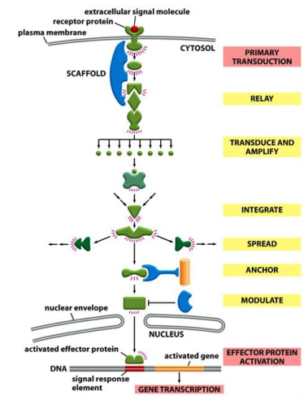
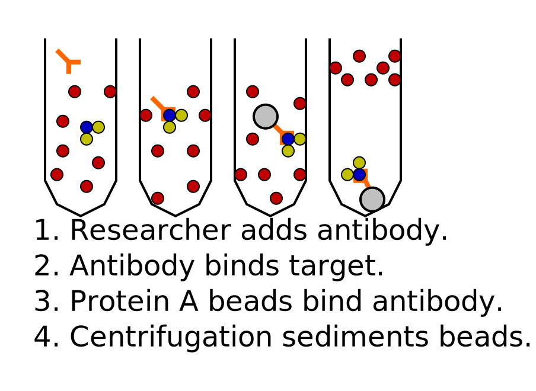

# 10. Cell communication Part I
> 20181026 H.F.
> A good solution to deal with sleep is to prepare question.

Quarum sensing in bacteria(群体感应现象), which can determinate the density of
the population in bacteria.
A Nice video to introduce
[anglerfish](https://video.nationalgeographic.com/video/weirdest-angler-fish)

## 10.1 Overview of cell communication
Chemical signaling involves ligands and receptors.

+ CELL-SURFACE receptors
+ INTRACELLUAR receptors

> What is the difference between ligand and receptor?

Here are Cell-Cell contact, Synaptic (fast), Paracrine(旁分泌)/autocrine 自分泌
(local environment)，endocrine 内分泌（long distance. These four types of cell
communication for different distances, with different speeds.

And effects in signaling can be fast and slow. _Protein synthesis_ is slow, but
_protein behavior_ is fast. The same signals trigger different effects, which
include same signal in different receptors, same signal and receptor but
different effector, same signal but vary concentration(morphogen).

> One of the key challenges 

Cell is programmed to respond to specific combinations of signals. Cell can
integrate multiple signals from various receptors to dictate _individual cell
behavir_. If we deprived of appropriate survival signals, a cell will undergo
a form of cell suicide known as apoptosis.

To ensure quicker response, many proteins in signaling have short **half lives**,
which have faster turn over rate react.

## 10.2 Signal perception & transduction by Intracelluar receptors
Signaling of NO in smooth muscle can relax blood vessel. NO's half life is
5-10 sec, which convert salt by water and O2. So nitroglycerin is used to treat
angina pectoris 心绞痛, which increase cGMP to diate of blood vessel. And Viagra
(Sildenafil) can inhibite cGMP degradation.

Signaling via nuclear receptor. Here are steroid hormones, Thyroid hormone,
Retinoids 维生素A。Nuclear receptors work either as homodimer or heterodimer.
Serve both as ligand receptor and gene transcription factor. Hormone receptors
can trgger both primary and secondary responses.

All of nuclear receptors 

## 10.3. General principles of cell surface signaling
These are three major classes of cell surface receports, ino-channel-coupled
receptors, G-Protein-Coupled Receport, Enyzme-Couple Receport.

The first messenger is extracellular singals. And the second messenger is small
molecules generated in larger number after receptor activation. Thery are either
hydrophilic or lipid diffusing, which work on effector proteins and relay
signals. Such as, cAMP, cGMP, Ca2+, diacylglycerol(DAG 甘油二酯), Inositol
triphosphate(IP3 肌醇三磷酸)。

Intracellular singaling proteins can: **relay** signals to the next compont,
act as a **scaffold** to bring two signaling proteins more quickly and
efficiently, **transform** the signal into a different form, **Amply** the
signal it receives---signal cascade 瀑布, **Integrate** signals from two or more
pathways, Spread signals from one pathway to another--**crosstalk**, **Anchor**
signaling proteins to a specific structure. **Modulate** the activity of
signaling proteins.

Protein phosphorylation, GTP-binding, cAMP or Ca2+ binding, Ubiquitination
are important types of switch to regulate protein activity.

Protein phosphorylation is one major way of post-translational modification
to regulate protein activity. Here are two categories: Serine/Threonine
kinase and Tyrosine kinase. Protein kinases are major therapeutic targets in
human diseases. Signaling protein itself is a kinase which can phosphorylate
and activate downstream effectors---Phosphorylation cascade.

GTP-binding proteins(G-proteins)

To achieve high speed and specificity in signaling.
- Preformed signaling complex on a scaffold protein.
- Assembly of signaling complex on an activated receptor.
- Assembly of signaling complex on phosphoinositide docking sites.

Kinase can phosphorylate and activate downstream effectors.

## 4. Several methods to study cell signaling

Protein co-immunoprecipitation can be used to receptor-ligand interaction,
kinase-substrate interaction and other protein interaction partners.

Western Block

In vitro protein activity assay.

shRNA/siRNA, inhibitors work by triggering target mRNA degration.

Rescue assay is used to locate signaling protein on upstream or downstream.

## 5. Positive and negative feedback in signaling and signaling kinetics

Switchlike responses could be due to cooperative response, or concerted effect
of a simultaneous inhibition for the opposite reaction. Positive feedback can
give switchlike response.

Negative feedback allows adaptation/desensitization 脱敏 for cells. With a long
delay

All-or-none: Positive feedback can convert a short-term signal in a lone-term
answer.

