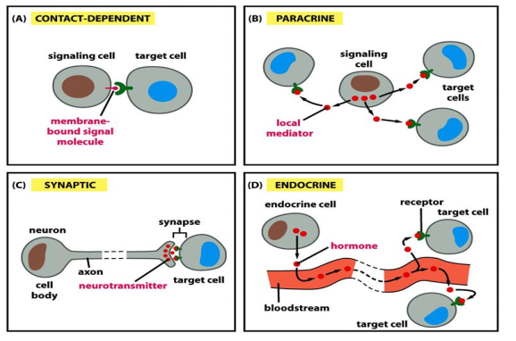
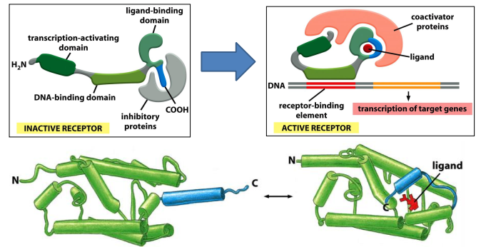
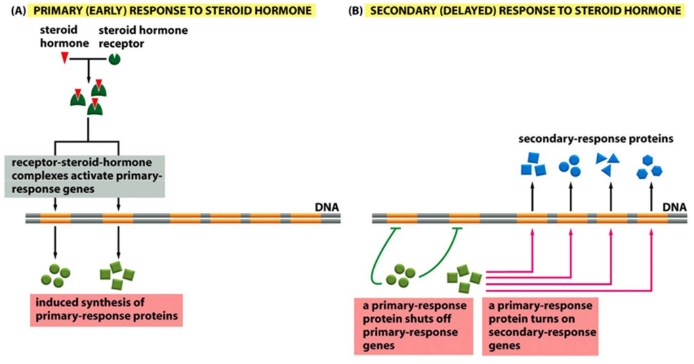
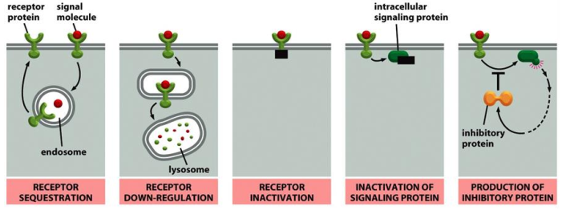

# 10. Cell communication Part I
> 20181129 H.F.
> A good solution to deal with sleep is to prepare question.

Quarum sensing in bacteria(群体感应现象), which can determinate the density of
the population in bacteria.
A Nice video to introduce
[anglerfish](https://video.nationalgeographic.com/video/weirdest-angler-fish)

## 10.1 Overview of cell communication
Chemical signaling involves ligands and receptors.

+ CELL-SURFACE receptors
+ INTRACELLUAR receptors

> What is the difference between ligand and receptor?

Here are Cell-Cell contact, Synaptic (fast), Paracrine(旁分泌)/autocrine 自分泌
(local environment)，endocrine 内分泌 (long distance). These four types of cell
communication for different distances, with different speeds.

And effects in signaling can be fast and slow. _Protein synthesis_ is slow, but
_protein behavior_ is fast. The same signals trigger different effects, which
include same signal in different receptors, same signal and receptor but
different effector, same signal but vary concentration(morphogen).

> One of the key challenges in cell biology is to understand how a cell
integrates all of this signaling information in order to make decisions: to
divide, to move, to differentiate, and so on

Cell is programmed to respond to specific combinations of signals. Cell can
integrate multiple signals from various receptors to dictate _individual cell
behavir_. If we deprived of appropriate survival signals, a cell will undergo
a form of cell suicide known as apoptosis.

To ensure quicker response, many proteins in signaling have short **half lives**,
which have faster turn over rate reaction.

## 10.2 Signal perception & transduction by intracelluar receptors
Signaling of NO in **smooth muscle** can relax blood vessel. NO's half life is
5-10 sec, which convert salt by water and O2. So nitroglycerin is used to treat
angina pectoris (心绞痛), which increase cGMP to dilate blood vessel. And
Viagra (Sildenafil) can inhibit cGMP degradation.

Signaling via **nuclear receptor**. Here are steroid hormones, thyroid hormone,
retinoids(made from vitamin A). Nuclear receptors 

+ work either as homodimer or heterodimer.
+ Serve both as ligand receptor and gene transcription factor. Hormone receptors
can trigger both primary and secondary responses.

## 10.3. General principles of cell surface signaling
These are three major classes of cell surface receptors

1. Ion-channel-coupled Receptors. The signaling molecule(transmitter) binds to
the receptor and triggers the opening/closure of the channel.
2. G(GTP-binding)-Protein-Coupled Receptors. The activation of a GRPC triggers
indirectly the activation of another membrane protein.
3. Enzyme-Couple Receptors. These receptors either are enzymes that activated
by the signaling molecule or they associate with enzymes which they activate.

The **first messenger** is extracellular signals. And the **second messenger**
is small molecules generated in larger number after receptor activation. They
are either hydrophilic or lipid diffusing, which work on effector proteins and
relay signals. Such as, cAMP, cGMP, Ca2+, Diacylglycerol(DAG 甘油二酯),
Inositol triphosphate(IP3 肌醇三磷酸)。

**Intracellular signaling proteins** can: **relay** signals to the next
component, act as a **scaffold** to bring two signaling proteins more quickly and
efficiently, **transform** the signal into a different form, **amply** the
signal it receives---signal cascade 瀑布, **integrate** signals from two or more
pathways, **spread signals** from one pathway to another--**crosstalk**,
**anchor** signaling proteins to a specific structure. **modulate** the activity
of signaling proteins.

Protein phosphorylation, GTP-binding, cAMP or Ca2+ binding, Ubiquitination
are important types of switch to regulate protein activity.

Protein phosphorylation is one major way of post-translational modification
to regulate protein activity. Here are two categories: Serine/Threonine
kinase and Tyrosine kinase. Protein kinases are major therapeutic targets in
human diseases. Signaling protein itself is a kinase which can phosphorylate
and activate downstream effectors---Phosphorylation cascade.

GTP-binding proteins(G-proteins): large trimeric GTP-binding proteins and small
monomeric GTPase.

To achieve high speed and specificity in signaling, **signaling complexes** is
formatted.

- Preformed signaling complex on a scaffold protein.

- Assembly of signaling complex on an activated receptor.

- Assembly of signaling complex on phosphoinositide docking sites.

Kinase can phosphorylate and activate downstream effectors.

## 10.4 General methods to study cell signaling

1. Protein co-immunoprecipitation(co-IP) can be used to receptor-ligand
interaction, kinase-substrate interaction and other protein interaction
partners.

2. SDS-PAGE followed by Western Block(WB) and immunodetection using specific
antibodies.
3. In vitro protein activity study: such as enzyme assays.
4. shRNA/siRNA, inhibitors work by triggering target mRNA degrade.
5. Rescue assay is used to locate signaling protein on upstream or downstream.

## 10.5 Positive and negative feedback in signaling and signaling kinetics
Switchlike responses(All-or-none) could be due to _cooperative response_, or
_concerted effect_ of a simultaneous inhibition for the opposite reaction.
Positive feedback can give switchlike response.

Negative feedback allows adaptation/desensitization 脱敏 for cells. With a long
delay.

