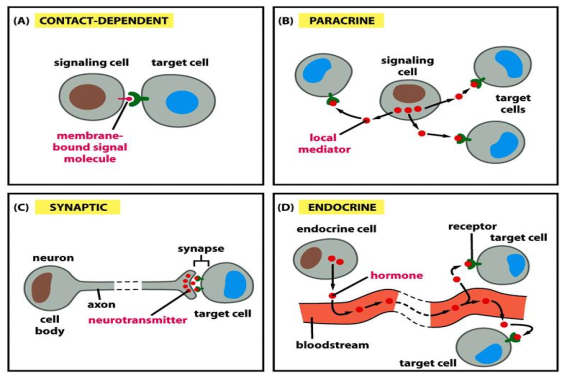
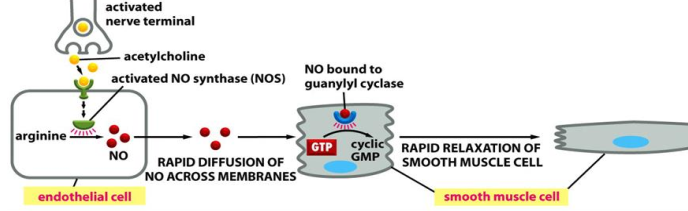
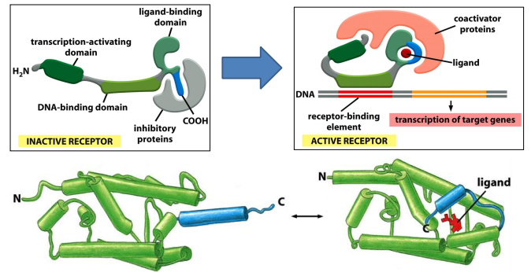

# Lecture 10 Cell communication Part one

Quarum sensing in bacteria(群体感应现象)
A Nice video to introduce
[anglerfish](https://video.nationalgeographic.com/video/weirdest-angler-fish)

##1. Overview of cell communication
+ CELL-SURFACE receptors
+ INTRACELLUAR receptors

> What is the difference between ligand and receptor?

Here are Cell-Cell contact, Synaptic (fast), Paracrine(旁分泌)/autorine 自分泌
(local environment)，endocrine 内分泌（long distance）

Effects in siganling can be fast and slow. Protein synthesis is slow, but
protein behavior is fast. The same singals trigger different effects, which
include same signal in different receptors, same signal and receport but
different effector, same singal but vary concentration(morphogen).

Cell is programed to respoond to specific combinations of signals. If deprived
of appropritate survival signals, a cell will undergo a form of cell suicide
known as apoptsisi.

To ensure quicker response, many proteins in signaling have short half lives,
which have faster turn over rate react.

## 2. Intracelluar receptors

Sigaling of NO in smooth muscle can relaxate blood vessel. NO's half life is
5-10 sec, which convert salt by water and O2. So nitroglycerin is used to treat
angina pectoris 心绞痛, which increase cGMP to diate of blood vessel. And Viagra
(Sildenafil) can inhibite cGMP degradation.

Singaling via nuclear receptor. Here are steroid hormones, Thyroid hormone,
Retinoids 维生素A。Nuclear receptors work either as homodimer or heterodimer.
Serve both as ligand receptor and gene transcription factor. Hormone receptors
can trgger both primary and secondary responses.

## 3. General principles of cell surface signaling
These are three major classes of cell surface receports, ino-channel-coupled
receptors, G-Protein-Coupled Receport, Enyzme-Couple Receport.

## 4. Several methods to study cell signaling

## 5. Positive and negative feedback in signaling and signaling kinetics
