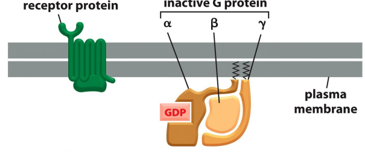
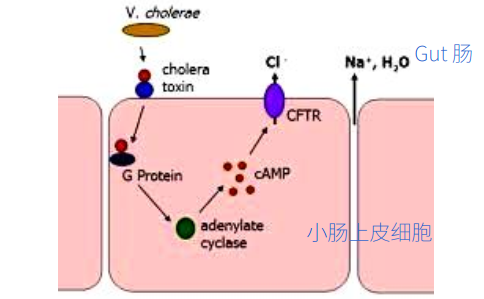
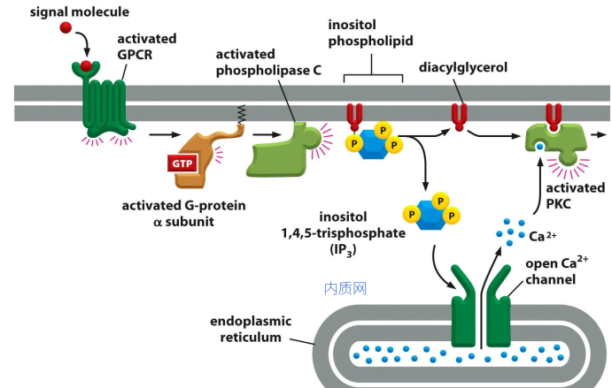
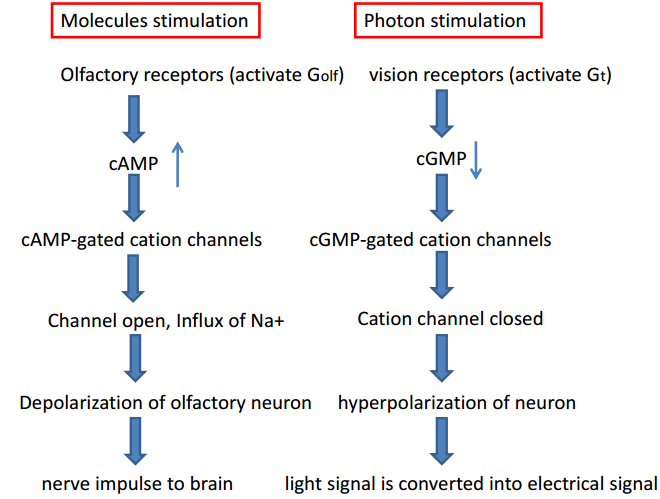
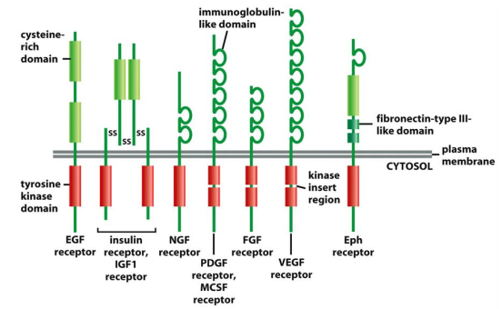
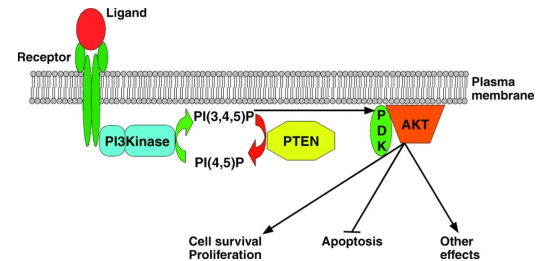
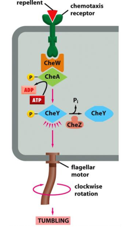

# 11. Cell Communication Part II
> 20181109 H.F.

## 11.1 G-protein coupled receptor signaling
GPCRs is the largest cells surface receptor family, which are 7-pass
transmembrane protein and need trimeric GTP-binding protein to relay signals.
> 如何在时间和空间上进行识别？ 如果一百年前，这样的分子生物学内容，那会有对应
的数学问题吗？

G-protein is coupled to GPCR. Trimeric G-protein has alpha, beta and gama
subunits.

G protein can by activated b an activated GPCR, which also can be deactivated
by GTP hydrolysis.

The process?

cAMP level are balanced by adenylyl cyclase and Cyclic AMP phosphodiesterase.
Gs(stimulatory G protein) activates adenylyl cyclase, while Gi (inhibitory G
Protein ) inhibits adenylyl cyclase.

PKA (cAMP-dependent protein kinase) mediates cAMP signaling in a fast manner. PKA
is a serine/Threonine protein kinase, through phosphorylation on substrates. PKA
also can work in low manner.

Mechanism of Cholera toxin. Cholera toxin finally result in ribosylation of ADP,
so that alpha unit can no hydrolyze its bound GTP, which causes remaining in
active state. --> cAMP up --> Cl ion out flux to gut --> Na ion and water out
flux to gut.

It is difference for pertussia toxin, which finally cataylze the ADP ribosylation
of alpha subunit of Gi. So G protein is locked in GFP (inactive) state. Mucus
secretion (唾液) increse in the lung, which also cause whooping cough.

GPCR trigger Ca2+ release and PKC active. Cell can keep low Ca2+ in cytosol in
may way.

Cyclic-nucleotide-gated ion channel downstream of GPCR in smell and vision. Rod
photoreceptor cell can response to light. 1-ci-retinal accepte photon to
isomerize, then rhodopsin conformational change, activated Gt(transducin),
activate cGMP phosphodiesterase, close ion channel, membrane potential is altered
by 1 mV. This transduction process contain signal amplificatin.

GPCR can be desensitized in many way.

How do cells keep low Ca2+ concentration in cytosol. 5 way.

Ca2+ oscillation in cell in response to stimuli as positive and negative feedback.
(still unknown)

GPCR desensitization

+ G

## 11.2 Enzyme-linked receptor signaling
All these are single transmembrane receptor, which either is itself an enzyme or
directly associates with an enzyme. It can be divided into 6 classes: **receptor
tyrosine kinase(RTK), Tryosine-kinase-associated receptors, receptor Ser/Thr
kinase, Histidine-kinase-associated receptors, Recetor guanylyl cyclases--cGMP,
Receptorlike tyrosine phosphatases**.

> Just because the different between amino acid

### RTKs： Receptor tyrosine kinase 酪氨酸

RTKs contain three domains:
- Extracelluar region: interact with ligand
- One single transmembrane domain:
- Intracelluar region: tyrosine kinase activity
A mutant RTKs can acts as dominant negative manner after mutation. Phosporylation
on RTK can 1) activates RTK kinase activity, 2) introduce phospho-Tyr that can
recruit other protein factors to relay signals.

There are several important signal pathways downstream of RTK: **Ras, Rho, PI3K**
pathway. Activation of Ras downstream of RTK mediated by Grb2 and Sos. MAP
（mitogen-activated protein) kinase signalig downstream of Ras, which control
both protein activity and gene transcription. Scafflod proteins provide precision
and avoid cross-talk between parallel MAP kinase modules.

Cancer

> What is ??

**Rho-GTPase**, can couple cell surface receptors to the cytoskeleton, which
control cell shape, polarity, migration, and aadhesion. For example: ephrin
induces growth cone collapse.

**PI3K** pathway promotes cell growth and survival. PI3K and PTEN(Phosphatase
and tensin homology) in controlling PIP3. PI3K hyperactivation and PTEN loss of
function frequently occur in human cancers.

## Tyrosine-kinase-associate receptors 酪氨酸
It recruit cytosolic tyrosine kinase to relay signal, form dimers upon ligand
binding. This family include: antigen receptors(BCR, TCR), integrin 整合素,
interleukin 白介素, receptors for many cytokines 细胞因子 and growth hormones.

### Serine/ Threonine kinase receptor 丝氨酸 苏氨酸
Single transmembrane receptor and Ser/Thr kinase. It has two classes:
- Type I: form homodimers, upon activation by ligand
- Type II: dimer phosphorylates Type I dimer to form active tetramer.
Serine/Threonine kinase receptors are for: TGF beta superfamily, Secreted and
dimeric proteins, ~30-40 members for human. It control diverse activity in
differentiation, proliferation, cell death, devlopment, etc.

### Histidine-kinase-associated receptors 组氨酸
Bacteria's chemotaxis are control by receptor-histidine-kinase-assocaited
receptors.  Normally, all motor rate counterclockwise, every sec or two,
some motor clockwis---tumbling. CheA---Histidine kinase which can phosphorylate
itself on histidine, CheA then transfters Phosphate group to Asp on CheY.

### Similar signaling in plants

