# 11. Cell Communication Part II
> 20181130 H.F.

## 11.1 G-protein coupled receptor signaling
GPCRs is the largest cells surface receptor family, which are 7-pass
transmembrane protein and need trimeric GTP-binding protein to relay signals.

> 如何在时间和空间上进行识别？ 如果一百年前，这样的分子生物学内容，那会有对应
的数学问题吗？

G-protein is coupled to GPCR. Trimeric G-protein has alpha, beta and gama
subunits.

G protein can by activated an activated GPCR, which also can be deactivated
by GTP hydrolysis.

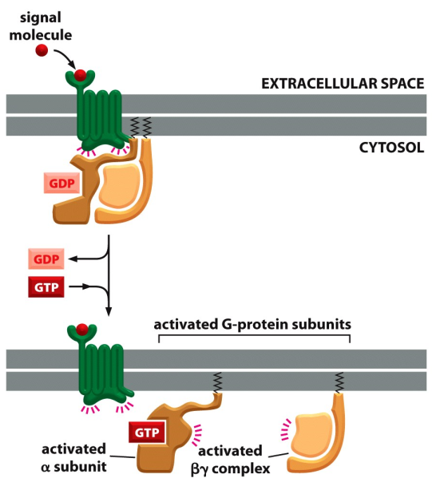
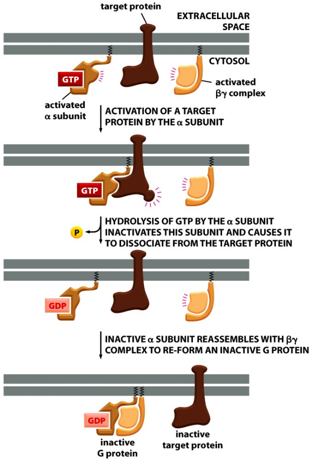

GPCR work step by step.

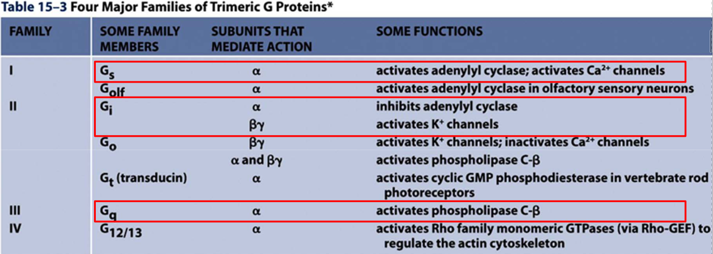

### The members of four major families of trimeric G‐proteins (I‐IV) control ion channels, second messengers & GTPases
GPCR signaling can be used to activate K + channels via the βγ subunit of the
trimeric G protein Gi. GPCR signaling can activate small second messenger
molecules.

### GPCR signaling can activate small messenger molecules
cAMP level are balanced by adenylyl cyclase and Cyclic AMP phosphodiesterase.
Gs(stimulatory G protein) activates adenylyl cyclase, while Gi (inhibitory G
Protein ) inhibits adenylyl cyclase.

Most of the cAMP signals are executed by the cAMP‐dependent protein kinase PKA.
PKA (cAMP-dependent protein kinase) mediates cAMP signaling in a fast manner.
PKA is a serine/threonine protein kinase, through phosphorylation on substrates.
PKA also can work in low manner, when PKA phosphorylates CREB and then activates
gene transcription.

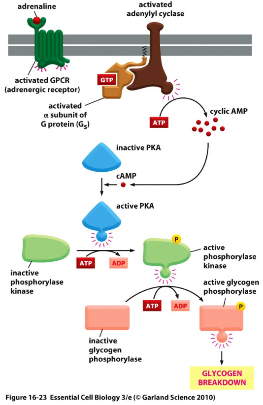

Mechanism of Cholera toxin: Cholera toxin finally result in ribosylation of ADP,
so that alpha unit(Gs) can't  hydrolyze its bound GTP, which causes remaining in
active state. --> cAMP up --> Cl- out flux to gut --> Na- and water out
flux to gut.

It is difference for pertussia toxin, which finally catalyze the ADP ribosylation
of alpha subunit of Gi. So G protein is locked in GDP (inactive) state. Mucus
secretion (唾液) increase in the lung, which also cause whooping cough.

Mediators of GPCRs: Ca 2+.
GPCR trigger Ca2+ release and PKC active. Cell can keep low Ca2+ in cytosol in
may way.

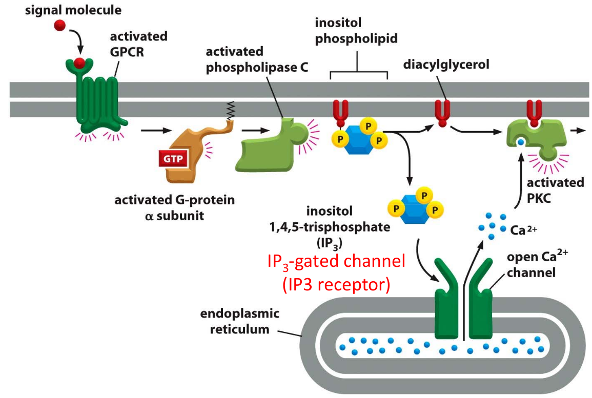
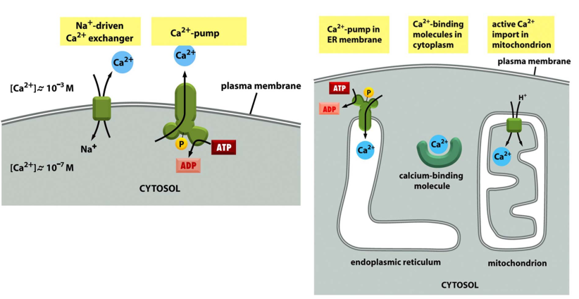

Ca2+ oscillation in cell in response to stimuli as positive and negative feedback.
(still unknown)

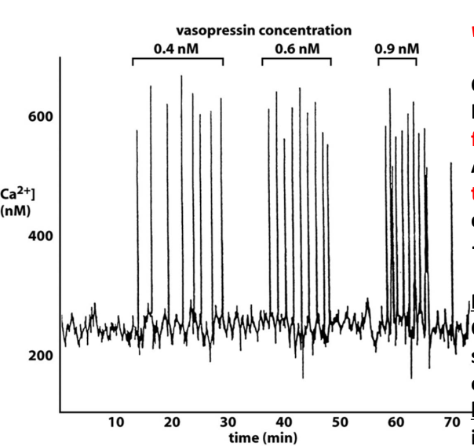

Cyclic-nucleotide-gated ion channel downstream of GPCR in smell and vision. Rod
photoreceptor cell can response to light. 1-ci-retinal accept photon to
isomerize, then rhodopsin conformational change, activated Gt(transducin),
activate cGMP phosphodiesterase, close ion channel, membrane potential is altered
by 1 mV. This transduction process contain signal amplification.

### GPCR can be desensitized in many way.
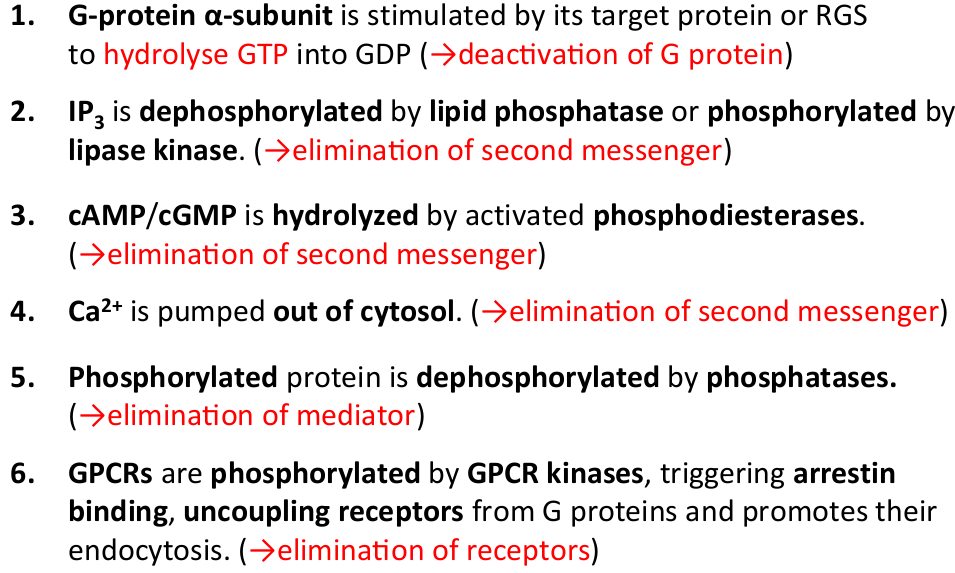

## 11.2 Signaling by Enzyme-linked cell surface receptor
All these are single transmembrane receptor, which either is itself an enzyme or
directly associates with an enzyme. It can be divided into 6 classes: 

1. Receptor tyrosine kinase(RTK)
2. Tryosine-kinase-associated receptors
3. Receptor Ser/Thr kinase
4. Histidine-kinase-associated receptors
5. Receptor guanylyl cyclases--cGMP
6. Receptor-like tyrosine phosphatases.

> Just because the different between amino acid

### RTKs：Receptor tyrosine kinase 酪氨酸

RTKs are kinase themselves and possess three domains:

- Extracelluar region: interact with ligand
- One single transmembrane domain:
- Intracelluar region: tyrosine kinase activity

Phosporylation on RTK can 1) activates RTK kinase activity, 2) introduce
phospho-Tyr that can recruit other protein factors to relay signals.

There are several important signal pathways downstream of RTK: **Ras, Rho, PI3K**
pathway.

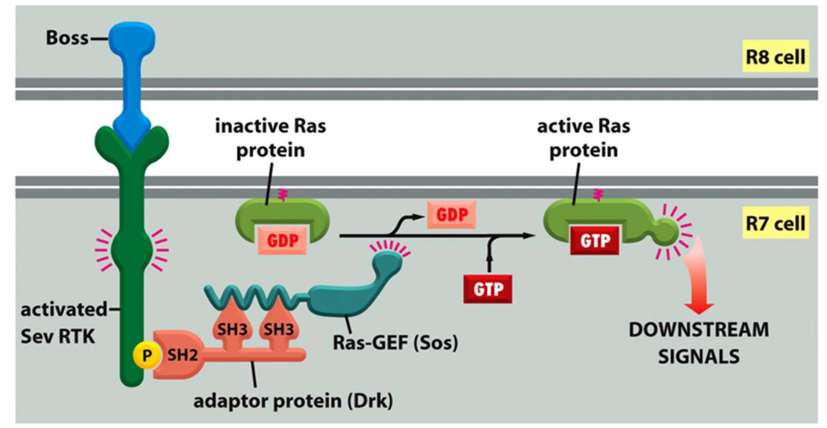
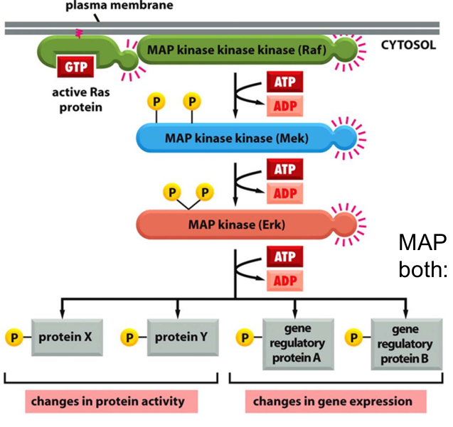

+ Ras Activation of Ras downstream of RTK mediated by Grb2 and Sos. MAP
（mitogen-activated protein) kinase signaling downstream of Ras, which control
both protein activity and gene transcription. Scaffold proteins provide precision
and avoid cross-talk between parallel MAP kinase modules.
+  **Rho-GTPase**, can couple cell surface receptors to the cytoskeleton, which
control cell shape, polarity, migration, and adhesion. For example: ephrin
induces growth cone collapse.
+ **PI3K** pathway promotes cell growth and survival. PI3K and PTEN(Phosphatase
and tensin homology) in controlling PIP3. PI3K hyperactivation and PTEN loss of
function frequently occur in human cancers.

### Tyrosine-kinase-associate receptors 酪氨酸
Tyrosine‐kinase‐associated receptors do not possess a kinase domain.
It recruit cytosolic tyrosine kinase to relay signal, form dimers upon ligand
binding. This family include: antigen receptors(BCR, TCR), integrin 整合素,
interleukin 白介素, receptors for many cytokines 细胞因子 and growth hormones.

Major types of cytosolic non-receptor tyrosine kinases.

+ Janus kinases(JAKs)
+ Scr (sarcoma virus) tyrosine kinase protein family
+ Focal adhesion kinase

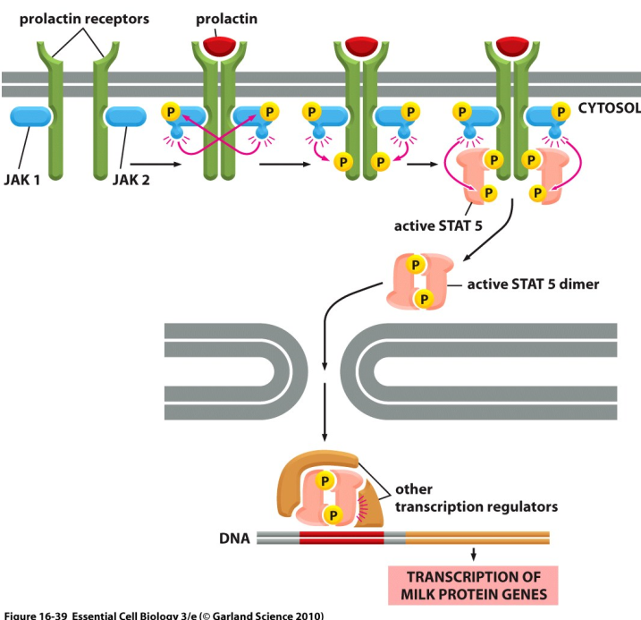

### Serine/ Threonine kinase receptor 丝氨酸 苏氨酸
_Single transmembrane_ receptor and Ser/Thr kinase. It has two classes:

- Type I: form homodimers, upon activation by ligand
- Type II: dimer phosphorylates Type I dimer to form active tetramer.

Serine/Threonine kinase receptors are for: TGF beta superfamily, Secreted and
dimeric proteins, ~30-40 members for human. It control diverse activity in
differentiation, proliferation, cell death, devlopment, etc.

### Histidine-kinase-associated receptors 组氨酸
Bacteria's chemotaxis are control by receptor-histidine-kinase-assocaited
receptors.  Normally, all motor rate counterclockwise, every sec or two,
some motor clockwis---tumbling.

CheA---Histidine kinase which can phosphorylate itself on histidine, CheA then
transfers Phosphate group to Asp on CheY.

