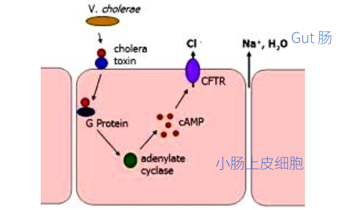

# Lecture 11 Cell Communication Part II

## I. G-protein coupled receptor signaling
GPCRs is the largest cells surface receptor family, which are 7-pass transmembrane
protein and need trimeric GTP-binding protein to relay signals.
> 如何在时间和空间上进行识别？ 如果一百年前，这样的分子生物学内容，那会有对应的数学问题吗？

G-protein is coupled to GPCR. Trimeric G-protein has alpha and gama subunits.

G protein can by activated b an activated GPCR, which also can be deactivated
by GTP hydrolysis.

cAMP level are balanced by adenylyl cyclase and Cyclic AMP phosphodiesterase.
Gs(stimulatory G protein) activates adenylyl cyclase, while Gi (inhibitory G
Protein ) inhibits adenylyl cyclase.

PKA (cAMP-dependent protein kinase) mediates cAMP signaling in a fast manner. PKA
is a serine/Threonine protein kinase, through phosphorylation on substrates. PKA
also can work in low manner.

Mechanism of Cholera toxin. Cholera toxin finally result in ribosylation of ADP,
so that alpha unit can no hydrolyze its bound GTP, which causes remaining in
active state. --> cAMP up --> Cl ion out flux to gut --> Na ion and water out
flux to gut.

It is diference for pertussia toxin, which finally cataylze the ADP ribosylation
of alpha subunit of Gi. So G protein is locked in GFP (inactive) state. Mucus
secretion (唾液) increse in the lung, which also cause whooping cough.

GPCR trigger Ca2+ release and PKC active. Cell can keep low Ca2+ in cytosol in
may way.

Cyclic-nucleotide-gated ion channel downstream of GPCR in smell and vision. Rod
photoreceptor cell can response to light. 1-ci-retinal accepte photon to
isomerize, then rhodopsin conformational change, activated Gt(transducin),
activate cGMP phosphodiesterase, close ion channel, membrane potential is altered
by 1 mV. This transduction process contain signal amplificatin.

GPCR can be desensitized in many way.

## II. Enzyme-linked recptor signaling
