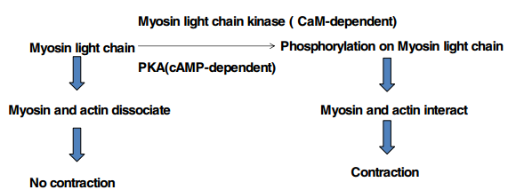

# 12. Cytoskeleton and Cell Movement I
> 20181109 H.F.

Here are 3 type of cytoskeleton system

|                      | Structure               |   Subunits        | Feactures
|----------------------|-------------------------|-------------------|----------
|Actin filaments       |Strands in double helix   |Actin  |Semiflexible, Motors, Polarized
|Intermediate filaments|Fibers wound into thicker cables  |Keratin or vimentin or lamin or others|Flexible, No motor, unploarized
|Microtubes            |Hollow tube   |alpha-and beta-tublin dimers|Stiff rods, Motors, Ploarized

Cytoskeleton can determine cell shapes and provide structure support, which are
important in cell migration. It anchor wites for organlle organization and
enzymes in specific location in cells. It is aboult phagocytosis, cell polarity,
cell division/cytokinesis, etc. Cytoskeleton is regulated by cell signaling in
**time and space**;

**Regulation of cytoskeleton function by signaling in time and space.**

## 12.1 Microfilaments and actin structures

Actin is highly conserved across species, most abundant protein in cells, which
has three isoforms(alpha-actin, beta-actin, gamma-actin).

G-actin is globular and monomeric actin. F-actin is filamentous, and linear
chain of G-actin. Here is a deep cleft between two lobes of G-actin, which
binds to ADP/ATP and Mg2+. For F-actin, all actin subunits are oriented the
same way.

## II. Dynamics of actin filaments
$C_C$ is the concentration of free G-actin at which the assembly onto a filament
end is balanced by loss from that end.

**Actin readmilling** occurs when one end of a filament grows in length while
the other end shrinks resulting in a section of filament seemingly "moving"
across a stratum or the cytosol. This is due to the constant removal of the
protein subunits from these filaments at one end of the filament while protein
subunits are constantly added at the other end.(缺张图)

> Actin monomer availability controls actin filament assembly. ?

## III Mechanisms of actin filament assembly
Two major classes of actin nucleating protein, which controlling this critical
step:
1) Formin protein family,longfilament assembly.
2) Arp2/3 complex, branched filament assembly.

Formins are regulated by Rho-GTPs. Arp2/3 complex is regulated by WASp. **?**
Formin mediates straight filament assembly, while Arp2/3 mediates branced
fiament assembly.

Cytochalasin D 细胞松弛素 and Latrunculin can depolymerizate microfilament.
Jasplakinolide and Phalloidin 鬼笔环肽 can enhance effect of polymerization.
So phalloidin has been used extensively in research for fluorescence-labelling
F-actin.

## IV Organization of actin-based cellular structures
Varous actin filament crosslinking many proteins, which form actin network in
cells.

## V. Myosins: Actin-based motor proteins 肌球蛋白
A larger family(>40) of motor proteins that can move along with filaments, with ATP
hydrolysis activity.

Myosin II contains head(2 heavy chains, 2 essential light chains), Neck, Tail.

Myosin head drives actin movement.

## VI. Myosin-powered movements
### 6.1. Myosin II
Mechanisms of muscle:
**Nebbulin** provide sacffold and structural support, molecular ruler.
**Titin** is molecular spring, **Cap Z** and **alpha-actinin**

Signal Control: 横管（亦称T[型]小管，英语：**T-tubule**）是肌膜（一种细胞膜）上很深的内陷
凹槽，目前只在骨骼肌细胞和心肌细胞上发现。这些横小管能够让膜去极化并迅速吸入细胞内部。
Movement Mechanism Switch: _Troponin and tropomyosin_ can control the skeletal
muscle contraction. Smooth muscle and non-muscle cells have lesswell-ordered
contractile bundles of actin and myosin, which is regulated by myosin light-chain
phosphorylation.

### 6.2. Myosin V
Because myosin V can swing 30 to 40 nm of lever arm, myosin V can transport
organelle/mRNA by walking along actin fiilaments.

## VII. Cell migration

> How actin cause protrusion in leading edge??

