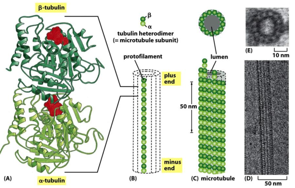
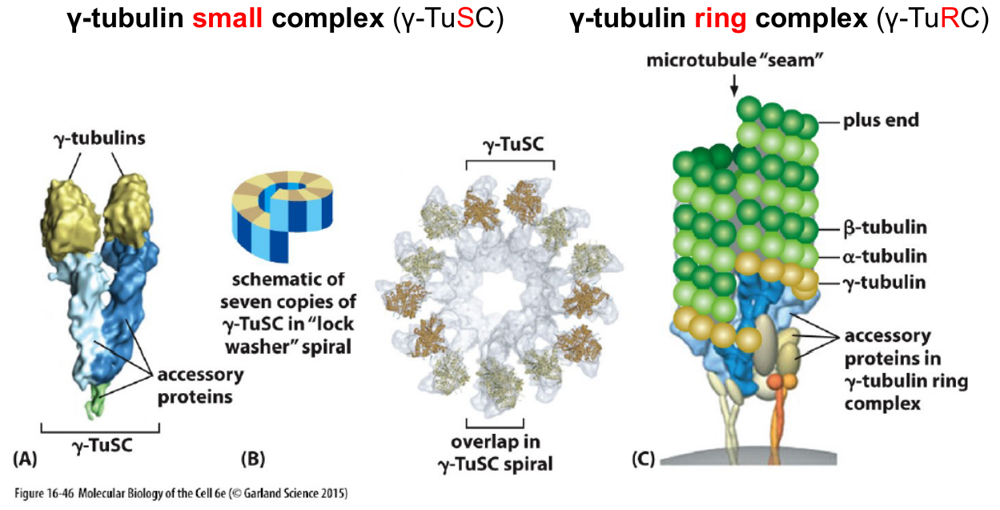
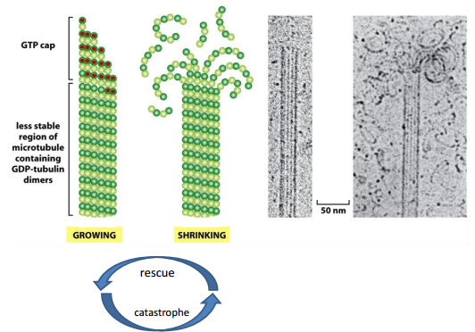
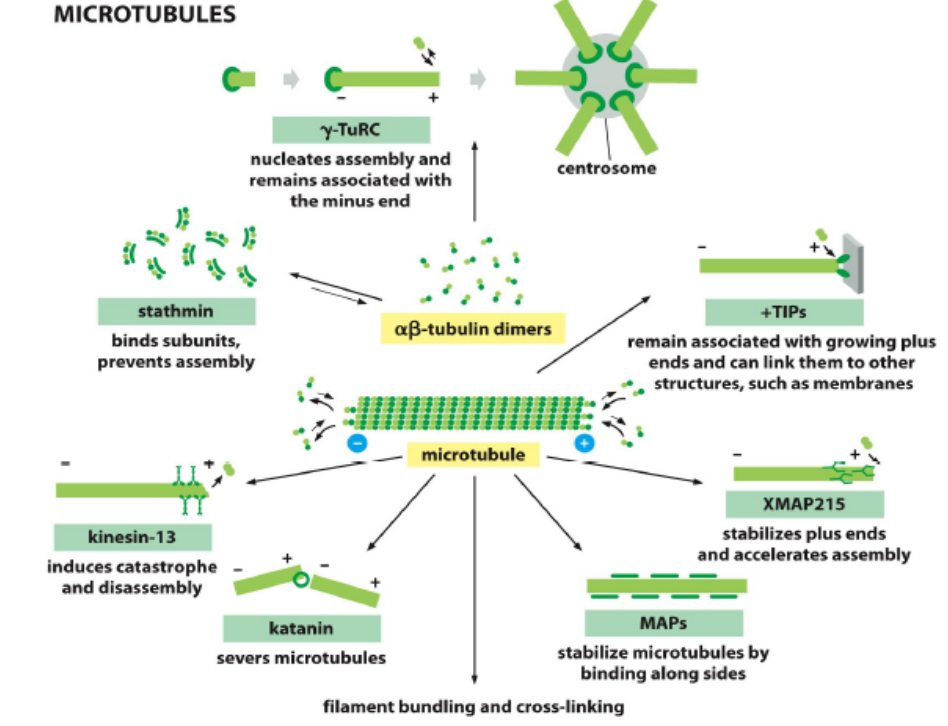
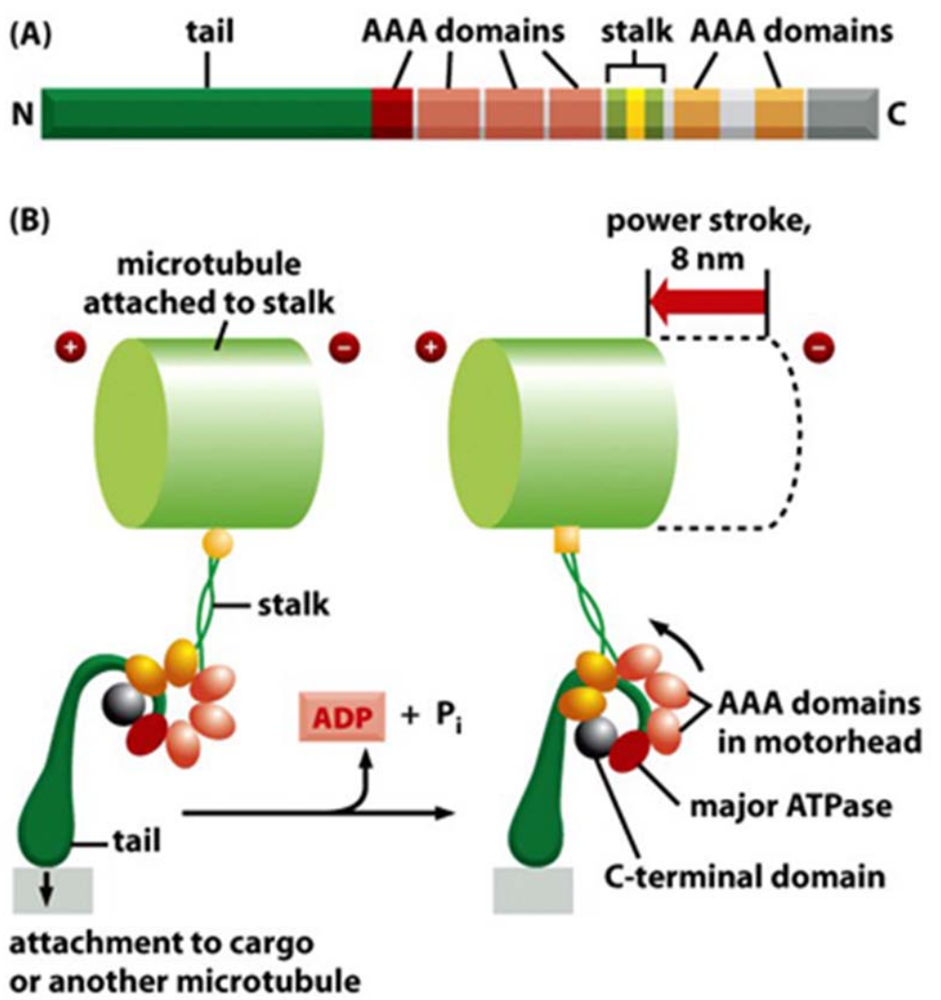
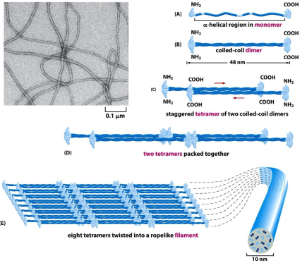

# 13. Cytoskeleton and Cell Movement II
> 20181121 H.F.

## 13.1 Microtubule
Microtubule exist in mitotic spindle, structural support in axon, structural
elements in cilia and flagella, centriole, basal bodies. Most microtubles are
singles, some are in doublet(cilia, flagella), some are triplet(basal bodies and
centrioles).

Most have 13 protofilaments, two major types of tubulin
(alpha-tubulin, and beta-tubulin) forming heterodimer. All subunits are oriented
in same way, the one with exposed **alpha-tublin in minus end**,
**beta-tubulin** is **plus end**. The GTP on alpha-tubulin is never hydrolyzed,
but GTP on beta-tubulin is hydrolyzed. Gama-tubulin is important for microtubule
assembly, MAP(Microtubule-associated-protein) are important in assembling and
dynamics for microtubules.

Gamma-tubulin ring complex(gama-TuRC)(Growth from minus to puls), perientriolar,
is critical to assemble microtubles. Microtube is dynamics instablility.
Individual microtubles can therefore alternate between a peroid of slow growth
and a period of rapid disassemble. Like actin, assembly at puls end is much
faster than assembly at minus end. The last gamma-tubulin lies beneath the
first, which resulting in 13 exposed gamma-tubulin subunits in a circular
orientation that matches the orientation of the 13 protofilaments in a
microtubule!!!

Microtubule interconversion and between a grow, called dynamics instability.
Microtubule rapid growth with GTP-capped end. When accidental loss of GTP cap,
it rapid shrinkage. But it will rescue after regain of GTP cap. Taxol(紫衫酚)
an other drugs can influence tubulin assembly. 

Microtubule can be stabilized by side-binding proteins: tau, MAP2, MAP4, which
are control by phoshorylation(补丁). Microtubule plus end binding proteins
(kinesin-13, XMAP215 解胶剂) modulate microtubule assembly.

## 13.2 Kinesins and dyneins: microtubule-based motor proteins 驱动蛋白和动力蛋白
We can isolate axon from giant squid to study microtubule transport.

Kinesin family toward plus end(anterograde, expect kinesin-13,kinesin-14).

Dynein is retrograde---toward minus end.
Dyneins are the largest of the known molecular moteors, and thy are also among
the fasters: axonemal of dyneins attached to a glass slide can move microtubles
at the rate of 14 mcirometer/sec. Dynein need dynactin to link cargo.

 

## 13.3 Cilia and flagella
They both are built from microtubule and dynein. Basal bodies---microtubule
assembly sites for cilia and flagella. In axoneme of cilia and flagella, here
are "9+2" arrangement for microtube. Because the existence of linking proteins,
the axoneme will bend between microtuble doublets. Genetic defectes in dynein
result in Kartagener's syndrome. Point mutation in a kinesin family member that
transport synaptic vesicle precursors down the axon, which resut in neurological
disease (Charcot-Marie-Tooth disease)进行性神经性腓骨肌萎缩症.

## 13.4 Intermediate filament
The diameter is 10nm. Intermediate filament is no polarity, no motor activity, tensile and stable,
hard to be solubilized, very heterogeneous(多相). Defects in keratin results in
skin bistering(水泡).

