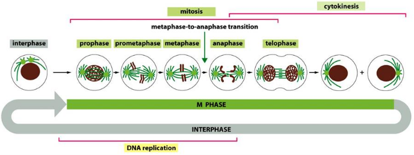

# Cell Cycle I

## 1. Overview
The major events in cell cyle:
+ G0: resting phase
+ G1:
+ S: DNA replication
+ G2:
+ M: nuclear division for mitosis, cytoplasmic divsion for cytokinesis.
  * Prophase
  * Prometaphase
  * Meatphase
  * Anaphase
  * Telophase

## 2. Model systems to study cell cycle
### 2.1 Yeast
1.5~2 hours, 

fission yeast (divides into two daughter cells)

budding yeast (budding yeast)

### 2.2 Xenopus oocytes
No cell growth (cleakge division)
### 2.3 Cultured mammalian cells
Normal primary cell culture, transformed immortal culture,

### 2.4 Drosohpila

+ Normal primary cell culture
+ Transformed immortal culture
+ Cancer cell lines

## 3. Various methods to study cell

Identification of M-phase cells
by morphological analysis using light 
### Visualization under microscope

### BrdU/EdU incorporation assay

### Cell cycle distribution assay
T analog incorporation analysis
Flow cytometry to detect cell cycle phase

## The cell cycle control system
+ G1/S phase transition checkpoint
+ Metaphase-to-anaphase transition checkpoint

Metaphase2anaphase is controlled by degradation of the S/M-cyclins.
APC/C

## III. S phase

