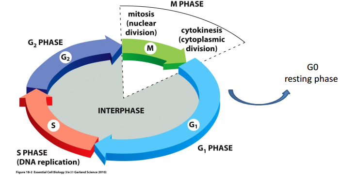
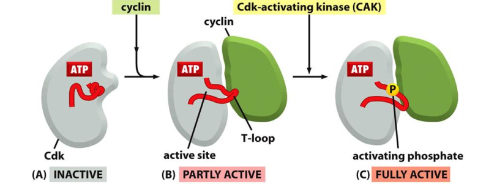
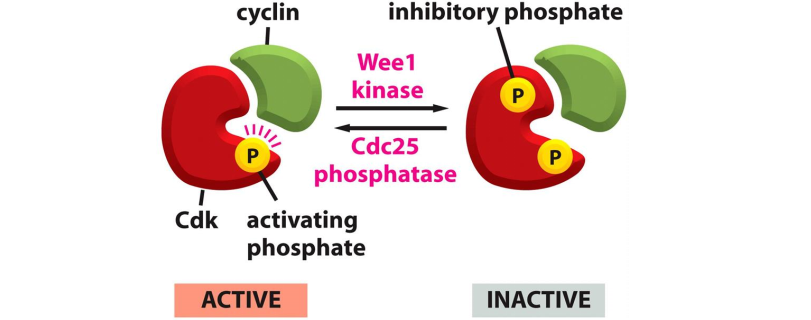
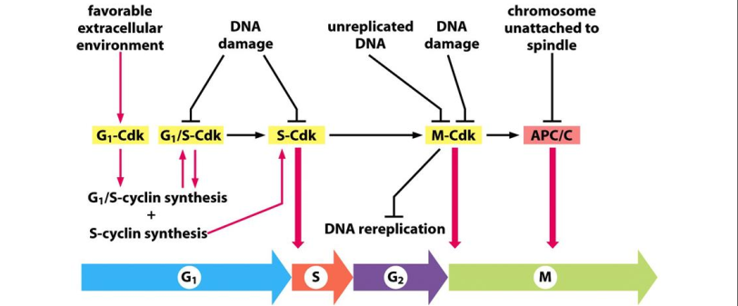
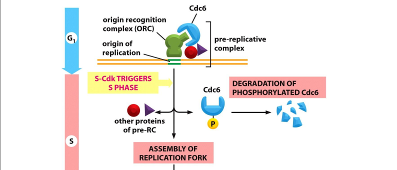

# 14.Cell Cycle I
> 20181122 H.F. 

Cell come from cell. This cycle of duplication and division is called cell
cycle. 

## 14.1 Overview
The major events in cell cycle: G0(resting phase), G1, S(NA replication), G2,
M(nuclear division for mitosis, cytoplasmic division for cytokinesis). M  phase
can be divide to: Prophase, Prometaphase, Metaphase, Anaphase（后期),Telophase(末
期).

Here are some **model systems** to study cell cycle.
**Yeast** to 1.5-3hours. Here are fission yeast (divides into two daughter
cells, rod) and budding yeast (budding yeast, oval). In restrictive(high) temp,
yeast don't proliferate. We can perform genetic mutaion with haploid cells
in high tempture.(??) **Xenopus'** oocytes is large and fertilized egg divides
without growing(hours). **Cultured mammalian cells** contain normal primary
cell culture, transformed immortal culture and cancer cell lines.

Various methods can be used to study cell, including 
1. visualization morphology under microscope
2. BrdU/EdU incorporation assay, cell cycle distribution assay.BrDU会被在复制中
正在合成DNA的细胞(为细胞周期中的S期)摄入，于复制DNA时取代胸腺嘧啶
Then treat cells are stained by BrdU antibody. 
3. Flow cytometry to detect cell cycle phase, while cell is used fluorescence dye to bind to DNA quantitatively. Also we can
identify M-phase cells by morphological under bright light microscope.

## 12.2 The cell cycle control system

Here are three major control checkpoints: G1/S phase transition, G2/M
transition, Metaphase to anaphase transition.

**Cyclins**(细胞周期素) and **Cycline-dependent kinase** (Cdk) are two major
players in cell cycles control.

1. **G1/S-cyclins** activate Cdks in late G1 and thereby help trigger progression
through Start, resulting in a commitment to cell-cycle entry. Their levels fall
in S phase.
2. **S-cyclins** bind Cdks soon after progression through Start and help
stimulate chromosome duplication. S-cyclin levels remain elevated until mitosis,
and these cyclins also control of some early mitotic events.
3. **M-cyclins**

Different cyclins oscillation in cell cycle and bind/control different Cdk
activity, which decides cdk substractes specificity and activates cdk. Cdk is
protein kinase, which phosporylates a subset of substrats to control cell cycle
progression at specific checkpoints.
**CAK**(Cdk-activating kinase) can
activate the activation loop of Cdk throuh phosporylation. Here is other
Cdk phosphorylate way by **Wee1/Cdc25**. However,Cdk inhibitor protein **CKI**
inhibits Cdk kinase activity, which can be degraded by SCF complex through
ubiquitination. Finally, Cyclins can be degraded through **ubiquitination**.

During metaphse to anaphase, APC/C function as ubiquitination ligase, resulting
in degration of M-Cyclin in proteasome.
> protein degration mediated by uniquitination

> Synchronized mean that cells start from the same point in cell cycle.
> Unsynchronized mean that cells start cell cycle diferently.

## 3. S Phase
How to ensure DNA replication once per cycle?
Chromosome duplication is triggered by the activation of S-Cdk, which activates
proteins that unwind the DNA and initiate its replication at replication origins.
Once a replication origin is activated, S-Cdk also inhibits proteins that
are required to allow that origin to initiate DNA replication again. Thus, each
origin is fired once and only once S phase and cannot be reused until the next
cell cycle.

