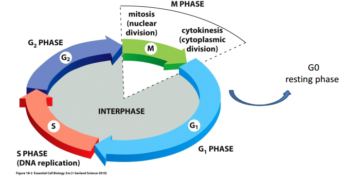
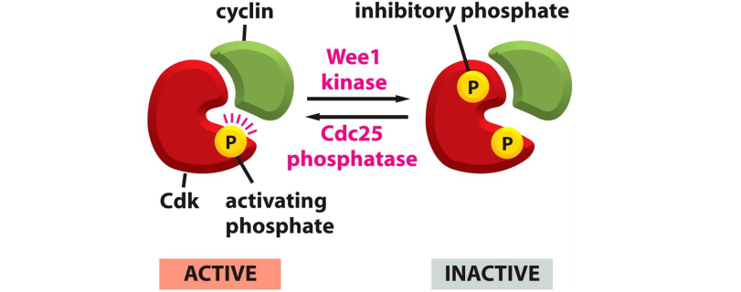
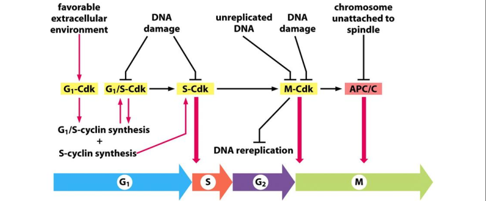
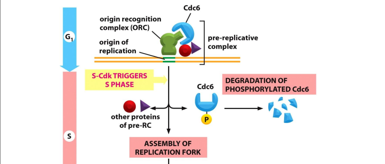

# LECTURE 14.Cell Cycle I
> Cell come from cell

## 1. Overview

The major events in cell cyle: G0(resting phase), G1, S(NA replication), G2,
M(nuclear division for mitosis, cytoplasmic divsion for cytokinesis). M  phase
can be divide to: Prophase, Prometaphase, Metaphase, Anaphase（后期),Telophase(末
期).

Here are some **model systems** to study cell cycle.
**Yeast** to 1.5-3hours. Here are fission yeast (divides into two daughter
cells, rod) and budding yeast (budding yeast, oval). In restrictive(high) temp,
yeast don't proliferate. We can perform genetic mutaion with haploid cells
in high tempture.(??) **Xenopus'** oocytes is large and fertilized egg divides
without growing(hours). **Cultured mammalian cells** contain normal primary
cell culture, transformed immortal culture and cancer cell lines.

Various **methods** can be used to study cell, including Visualization under
microscope, BrdU/EdU incorporation assay, Cell cycle distribution assay. BrDU会
被在复制中正在合成DNA的细胞(是为细胞周期中的S期)摄入，于复制DNA时取代胸腺嘧啶。Then treat
cells are stained by BrdU antibody. Flow cytometry to detect cell cycle phase,
while cell is used fluorescence dye to bind to DNA quantitatively. Also we can
identfy M-phase cells by morphological under bright light microscope.

## 2. The cell cycle control system

Here are three major control checkpoints: G1/S phase transition, G2/M
transition, Metaphase2anaphase transition. **Cyclins** 细胞周期素 and
**Cycline-dependent kinase** (Cdk) are two major players in cell cycles control.
Different cyclins ocsillate in cell cycle and bind/control different cdk
activity, which decides cdk substractes specificity and activates cdk. Cdk is
protein kinase, which phosporylates a subset of substrats to control cell cycle
progression at specific checkpoints. **CAK**(Cdk-activating kinase) can
activate the activation loop of Cdk throuh phosporylation. Here is other
cdk phosphorylate way by **Wee1/Cdc25**. However,Cdk inhibitor protein **CKI**
inhibits Cdk kinase activity, which can be degraded by SCF complex through
ubiquitination. Finally, Cyclin can be degradated through **ubiquitination**.

During metaphse to anaphase, APC/C function as ubiquitination ligase, resulting
in degration of M-Cyclin in proteasome.
> protein degration mediated by uniquitination

> Synchronized mean that cells start from the same point in cell cycle.
> Unsynchronized mean that cells start cell cycle diferently.

## 3. S Phase
How to ensure DNA replication once per cycle?

