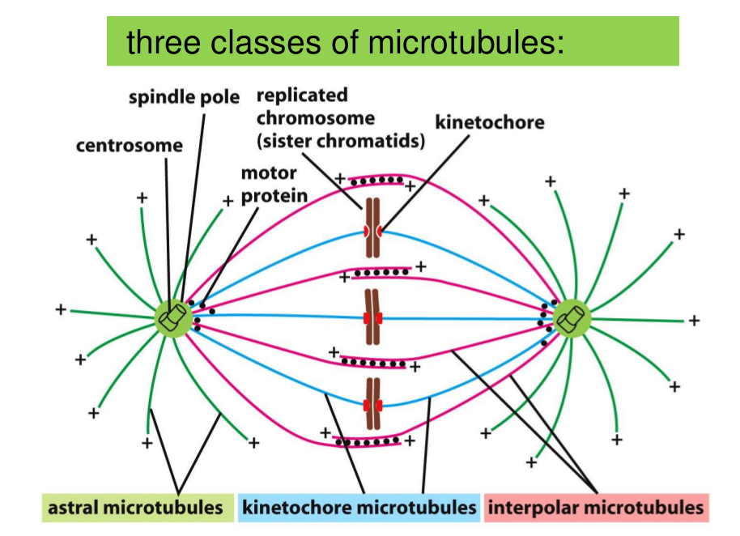

# Lecture 15. Cell cycle II

## I. Mitosis

Like bike.

Formation of spindle

### Microdtubule instability increase greatly in mitosis

### Self-organization of spindle

### Kinetochores attach sister chromatids to the spindle

## II. Cytokinesis
**Four Stages:**
+ Initiation
+ 

Spindles determine the postion of cleavage furrow:
Three models:
 A) astral stimulation model
 B) central spindle stimulatino model
 C) stral relaxation model

### Organelle division

Mitosis without cytokinesis

Symmetrical and asymmetrical division

## III. Control of cell division and cell growth

What is controlling organ size and orgranism size?
+ 1. Mitogens stimulate cell division
+ 2. Growth factors stimulate cell growth 
+ 3. 

2. DNA damage response

4. Coordination of cell grwoth and cell division 
    

How is cell size controlled precisely?
How is cell division numbers control precisely?
How to maintain the homeostasis in an organism?

