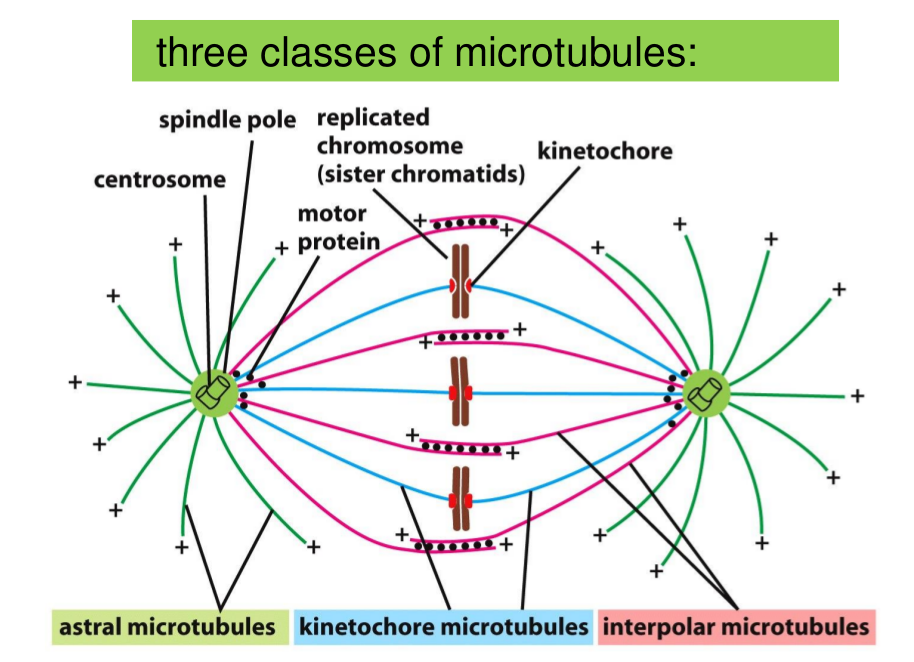

# LECTURE 15. Cell cycle II

## I. Mitosis

Like bike.

Formation of spindle

### Microdtubule instability increase greatly in mitosis

### Self-organization of spindle

### Kinetochores attach sister chromatids to the spindle
Chromose segreate in anaphase.

During telophse:
- Disassembly of the mitotic spindle
- Re-formation of the nuclear envelope ( fragments associated with chromosomes,
they coalesce to re-form the complete nuclear membrane)
- Dephosphorylation on important effectors plays roles in causing these effects

## II. Cytokinesis
Here are Four Stages in cytokinesis. During cytokinesis, mitochondria and
chloroplasts double and divide in each cell cycle. ER remain intact, cut into
two halves. Golgi apparatus fragmented and reorganized. It is intersting that
mitosis without cytokinesis in some organisms during some peroid, such as
Drosophilae embryo, blood platelets, heart muscle cell.

Three models of Spindles determine the postion of cleavage furrow have proposed:
 A) astral星 stimulation model.
 B) central spindle stimulatino model.
 C) stral relaxation model/

## III. Control of cell division and cell growth
To control organ size and organism size, here are: mitogens stimulate cell
division, Growth factors stimulate cell growth, Survival factors prevents cell
death.

To responce DNA damage, ATM/ATR kinase activte --> Chk1/Chk2 kinase activate -->
phosphorylate p53 to active p53--> active p53 bind to p21 gene -->p21(CKI) -->
arrest cell cycle both G1/S and G2/M transition. Typicaly, 50% of human cancer
have p53 loss or mutation.

**Mitogens** can stimulate cell divison, here are over 50 different mitogens,
including EGF,FGF, NGF, erthropoietin. Mitogens function by triggering a wave
of G1/s-Cdk. They mainly through phosphorylation on **Rb protein**, which acts
as _transcription factors_ to simulate G1/S cyclins,etc.

Several Coordination mechanisms of cell grwoth and cell division

## IV. Many questions remain
- How is cell size controlled precisely?
- How is cell division numbers control precisely?
- How to maintain the homeostasis in an organism?
