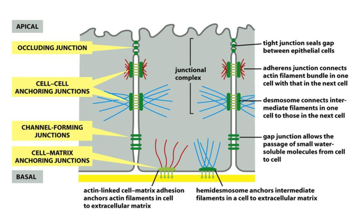
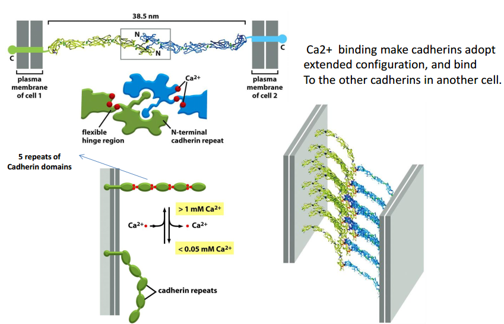
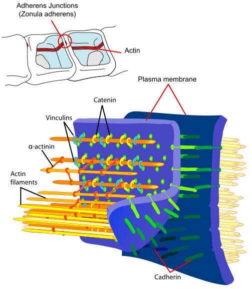
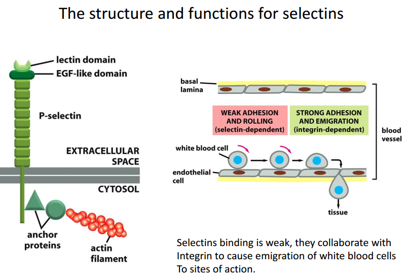
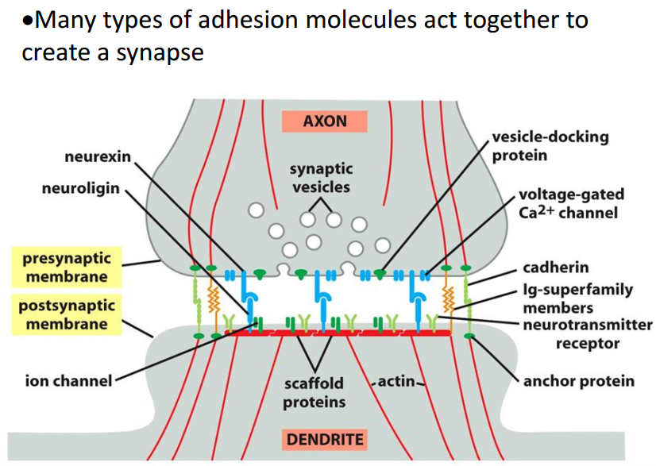
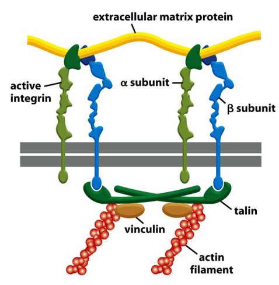
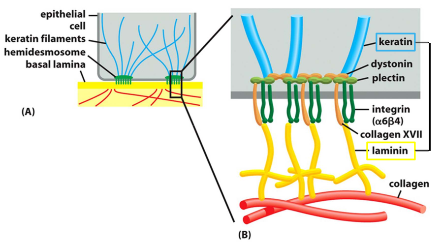

# 18. Integrating cells in Tissues I 
> 20181207 H.F
细胞连接，细胞间桥

Four major types of tissues: Epithelial tissue, Connective tissues, Neuron
tissue, Muscle tissue.

Cell junction and adhesion are very important for multicellular organisms. It
allow cells to aggregate into distinct tissues and bidirectional communication
between interior and exterior of cells.

## I. Overview of cell-cell and cell-ECM junction and adhesion.
Here are four major types of junctions: anchoring（锚定） junctions, occluding junction
(紧密连接), channel-forming junctions and signal relaying junctions.

## 18.2 Caderins and cell-cell adhesion
### 18.2.1 Cadherins family
Caderins (钙粘素) derived from ("Ca2+" + "adherin"), meaning Ca2+-independent. So EDTA/trypsin are
use to dissociate cells from tissue, EDTA can chelate Ca2+ to dsactive cadherins.
But plants, fungi, bacteria and archaea have no cadherins. Here are over 180
family members in humans.

### 2.2 Homophilic binding for cadherins
Homephilic adhesion mean that the same type of cadherin binds to the same type
cadherin.

Ca2+ binding make cadherins adopt extended configuration, and bind to the other
cadherins in another cell. 

### 2.3 Adherens jnctions（粘着小带）
Beta-Catenin link classical cadherins to the actin cytoskeleton in adherin
junction. So, myosin motor can cause contraction on the adhesion belt to from
epithelial tube.

### 2.4 Desmosome junctions 桥粒、胞桥小体
Cadherins links to intermediate fiaments, which given cell mechanical strength.
Desmosome junctions are plentifull in epithelium, but not found in Drosophila.

.svg)

### 2.5 Selectins in blood cells adhesion
Blood cells can transient adherin, means bind to lectins in Ca2+-independent. At
least 3 types for different selection.

**Immunoglobulin proteins** mediate Ca2+-independent adhesion. Bind to integrin.
Here are 3 type of protein: ICAM, VCAM, NCAM.

Many types of adhesion can form the synapse.

## 18.3 Integrins(整联蛋白) in cell-ECM adhesion

Integrins are transmembrane protein composed of alpha- and beta- subunits, which
can bind to extracellular matrix proteins. Because integrins play important role
in regulating cellular function and bidirectional signaling between the cell
and the matrix, defects in integrins signaling cause many genetic diseases.

Integrin cam switch between an active sold or inactive, from inside-out or
outside-in. 

Hemidesmosomes **spot-weld epithelial** cells to basal lamina by linking
lamina outside the cell to keratin filaments.

