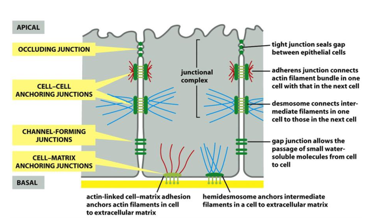
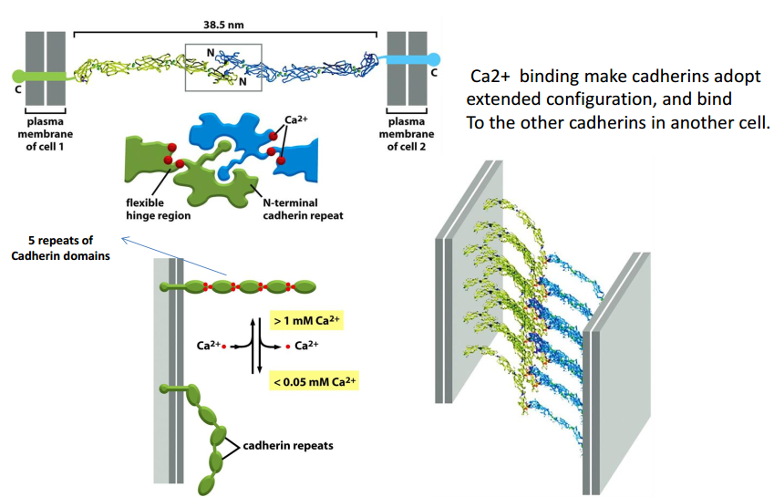
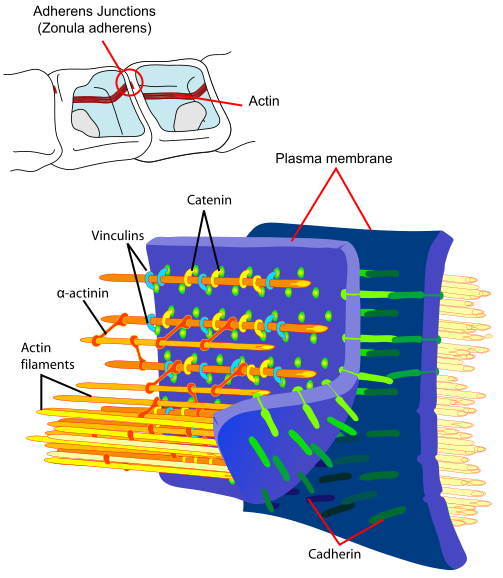
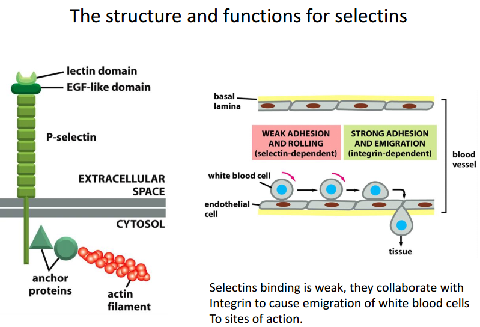
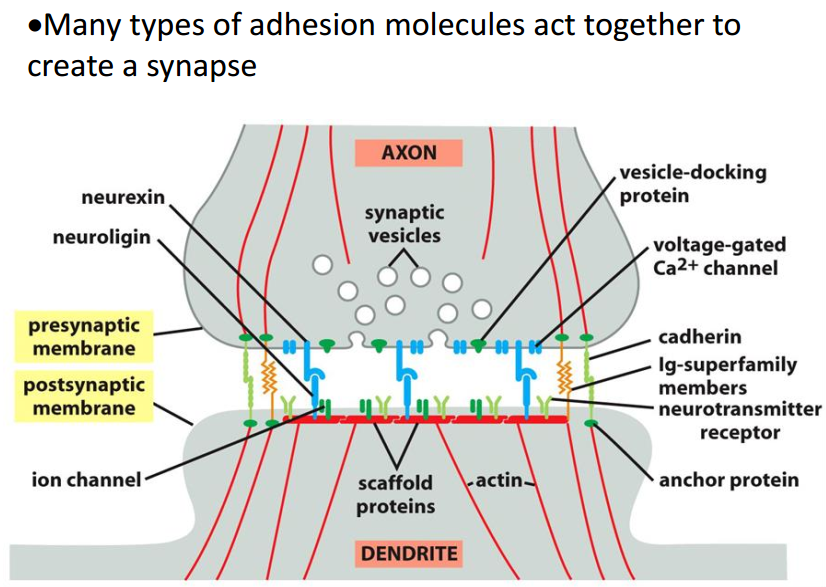
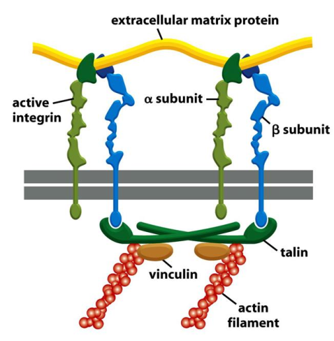

# 18. Integrating cells in Tissues 细胞连接，细胞间桥
Four major types of tissues: Epithelial tissue, Connective tissues, Neuron
tissue, Muscle tissue.

Cell junction and adhesion are very important for multicellular organisms. It
allow cells to aggregate into distinct tissues and bidirectional communication
between interior and exterior of cells.

## I. Overview of cell-cell and cell-ECM junction and adhesion.
Here are four major types of junctions: anchoring（锚定） junctions, occluding junction
(紧密连接), channel-forming junctions and signal relaying junctions.

## II. Caderins(钙粘素) and cell-cell adhesion
### 2.1 Cadherins family
Derived from ("Ca2+" + "adherin"), meaning Ca2+-independent. So EDTA/trypsin are
use to dissociate cells from tissue, EDTA can chelate Ca2+ to deactive cadherins.
But plants, fungi, bacteria and archaea have no cadherins. Here areover 180 family
members in humans.

### 2.2 homophilic binding for cadherins
The same type of cadherin binds to the same type cadherin.

Ca2+ binding make cadherins adopt extended configuration, and bind to the other
cadherins in another cell. 

### 2.3 Adherens jnctions（粘着小带）
Beta-Catenin link classical cadherins to the actin cytoskeleton in adherin
junction. So, myosin motor can cause contraction on the adhesion belt to from
epithelial tube.

### 2.4 desmosome junctions 桥粒、胞桥小体
Cadherins links to intermediate fiaments, which given cell mechanical strength.
Desmosome junctions are plentifull in epithelium, but not found in Drosophila.

.svg)

### 2.5 selectins in blood cells adhesion
Blood cells can transient adherin, means bind to lectins in Ca2+-independent. At
least 3 types for different selection.

### 2.6 Immunoglobulin proteins mediate Ca2+-independent adhesion
Bind to integrin.

Many types of adhesion can form the synapse.

## III. Integrins(整联蛋白) in cell-ECM adhesion
Integrins are transmembrane protein composed of alpha- and beta- subunits, which
can bind to extracellular matrix proteins. Because integrins play important role
in regulating cellular function, defects in integrins signaling cause many genetic
diseases.

