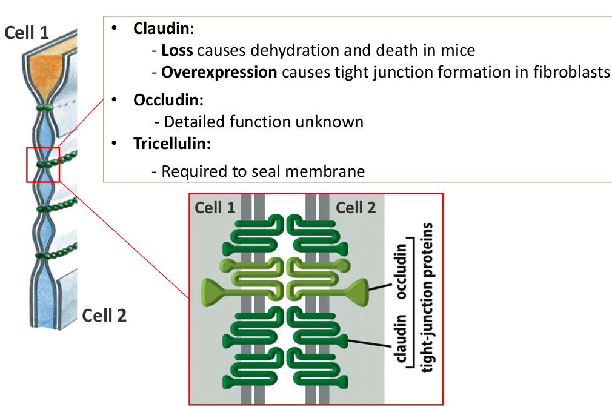

# 19 Integrating cells into tissues II
> 20181207 HF

## 19.1 Occluding(咬合) junctions
_Tight junctions_ can be found in epithelial tissue and endothelial tissue.
Here are the function:

+ Occluding protein seal the intercellular space between adjacent cells.
+ Serve as fences to separate domains with the PM
+ Tjs maintain cellular polarity
+ Tjs are selective for ions, but do not allow macromolecules to pass.

### Molecular organization of tight junctions
Three key proteins form tight junctions: claudin, occludin & tricellution.

Then scaffold proteins(_ZO/Tjp_) link claudins to the actin-cytoskeleton.

Structure of septate junction is more regular, "ladder-like" in parallel rows.
Septate junctions are formed by claudin homologs and scaffold proteins.

Cell adhesion is important to regulate cell proliferation. Such as the imaginal
discs of _Drosophila_

## 19.2 Channel-forming junctions
Allow direct exchange of small molecules and inorganic ions, but very few
macromolecules in rare exceptions. In animals, it form gap junctions; in
plants, it form plasmodesmata. 

Here are two protein families: Connexins(连接蛋白类) and innexins. Vertebrates
posses predominantly **connexins**, _Drosophila_ and _C.elegans_ possess only
**innexins**.

Gap junction have open and closed states. Closure is triggered by lower pH or
increase in calcium ions levels. Gap junctions can be regulated by extra

## 19.3 Basal Lamina(薄层)
4-120nm in thickness, mechanical role, determines cell polarity, influence cell
metabolism, cell survival, proliferation, migration and differentiation.

### 3.2 Composition of badsal lamina
Fibrous(纤维的) proteins(with short oligosaccharide side chains) and proteoglycans
(proteins with polysaccharides,glycosaminoglycans---GAGs).

## 19.4 Extracellular Matrix(ECM)
ECM is 

Degradation of extracellular matrix
