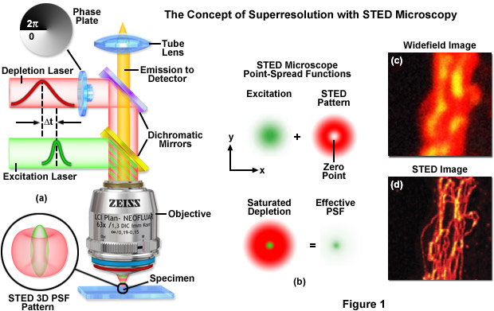

# 2.Visualization of cells

> 20180926 by H.F., a better review should do

## 2.1 Light microscopy: 200nm
The image pripicle

Resultion=0.61xlength/n sin(theta)

What if we only receive the light of first grade in Airy Disk

Bright Field, Phase Contrast, Differential-interference-contrast, Dark Field.

## 2.2 Fluorescence microscopy
Show only what we wonder, and when.

Protein, dye, antibody, 

## 2.3 Confocal microscopy
Higher SNR, lower background
Pinholes is the hole
Q: the size of pinhole is about equal to size of exciting.

## 2.4 Nanoscopy
Higher Resolution

How the STED work?

## 2.5 FRAP/FRET/Photoacivation
The protein interaction(less than 20nm)

Förster resonance energy transfer(FRET): analogous to near-field communication,
in that the radius of interaction is much smaller than wavelength of light
emitted. In the near-field region, the excited chromophore emits a virtual
photon that is instantly absorbed by a receiving chromophore. These virtual
photons are undetectable, since their existence violates the conservation of
enery and momentum, and hence FRET is known as a radiationless mechanism.[1]

FLIM: Measure

## 2.6 Electron microscopy: 0.1nm
0.1nm-1nm resolution

## Reference
- [1]https://en.wikipedia.org/wiki/F%C3%B6rster_resonance_energy_transfer

