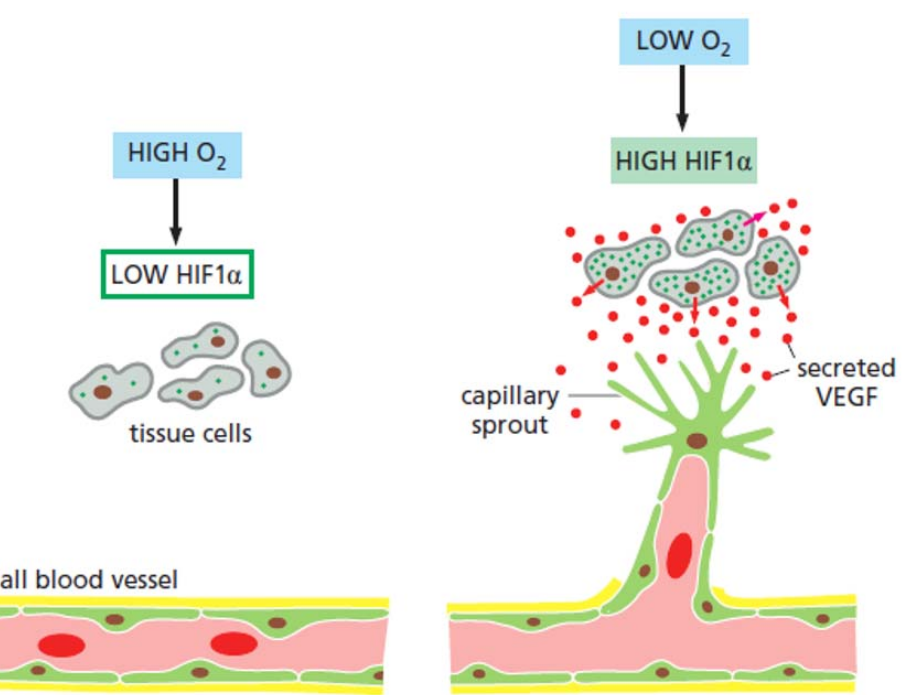
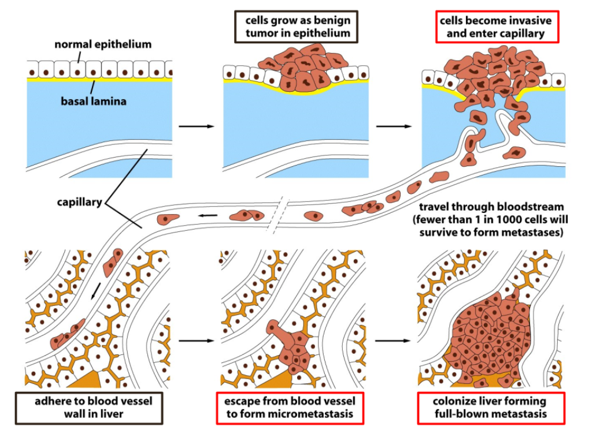

# 21. Cancer I
>20181214 H.F.

## 21.1 The nature of cancer
Cancer, in Greek, means a _crab_.

Most Cancers Derive from a Single2 Abnormal Cell

When the DNA at the site of translocation is cloned and sequencsd, it is found
that the site of breakage and rejoining of the translocated fragments is
identical in all the leukemiccc cells in any given ptient, but that this sites
differs slightly from one patient to another. This is the expected result if.
and only if, the cancer in each patient arises from a unique accident occurring
in a single cell.

A single mutation is not enough to change a normal cell into a cancer cell.
If only a single muation were required to trigger the cancer and this cancer
would be the same at all ages. But in fact, for most types of cancer, the
incidence rises steeply with age.

Definition of Cancer: **Cancer cells** are cells that grow beyond limitations.
Then cells grow out of control and they have sustaining proliferating potential.
Generally, we different tumors in place as primary tumor and metastasis
(secondary tumor), or genign tumor and malignant tumor.

Some cancer: CIN(Cervix intraepithelia neoplasia, 子宫颈癌), Osteosarcoma(骨癌)

Carcinoma, Sarcoma, Leukemia/lymphoma, Neurological tumor.

## 21.2 Features of cancer: monoclonal origin/clonal descendance

CML:

Somatic mutations

Cancer genomes are highly unstable.

Abnormal responeses to DNA damage and other stresses. p53 mutations, ATM
mutations, failure to arrest cycle or/and failure to cause apoptosis: each
resulting in producing more genetic mutations in each cycle.

Tumors induce the formation of new blood vessels to secure their own supply
with oxygen and nutrients.

**Angiogenesis**: new formation of blood vessels. Cells sense the amout of
available oxygen and nutrients. If levels are too low, they call fo supply. The
VEGF protein and HIF1-alpha transcription factor for VEGF.

**Metastasis** is a mulit-step procudure.

## 21.3 Putative causes of tumors and cancer

## 21.4 Cancer critical genes

## 21.5 Multi-step tumorigenesis

## 21.6 Cancer stem cells

## 21.7 Tumor metastasis

## 21.8 Tumor treatment
CAT-T
