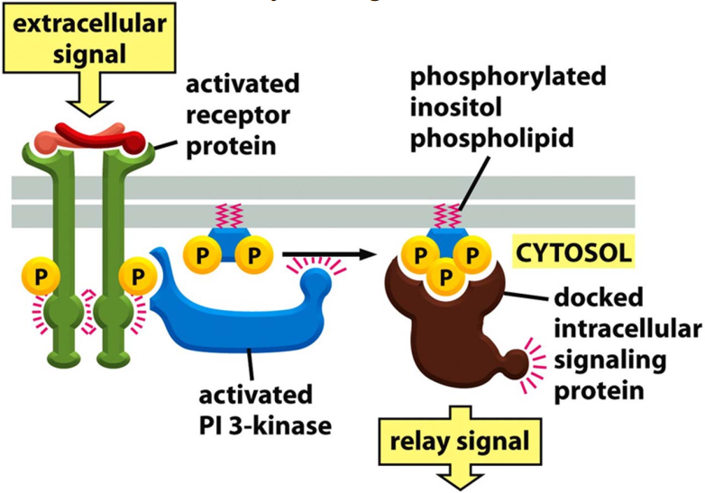

# 4. Membrane structure
> 20180926 H.F.

> _How the possible be possible?_ What and how make a difference?

Cell membrane is a biological membrane that separates the interior of all cells
from the outside env.

## 4.1 Overview of membrane
+ Double membrane:
	nucleus, mitochondrion, chloroplast.
+ Single membrane: proxisome(过氧化物酶体), endoplasmic reticulum, lysosome,
  Golgi apparatus, plasma membrane, transport vesicle.

The  lipid bilayer is about 5nm thick.

Cell membrane act as selective barriers. Relatively impermeable barrier, fluid,
dynamic, composed of protein and lipid.

Functions of plasma membrane include:
compartmentalization(划分), Scaffolding, Gatekeeper, Sensors of outside signals,
Energy transduction. So, the surface of membrane is not smooth.

## 4.2 Lipid bilayer
### Basical materials
Phospholipids(PI, PE, PS, PC, Sphingomyelin), Cholesterol(sterols), Glycolipids
and other lipid in membrane. Lipid composition defines the properties of
membranes(visosity, curvature)
(Remember the different molecule formation)

_Phosphoglycerides_ and _Sphingomyelins_ are two major groups of phospholipids
based on different backbone. The phosphoglyceride molecule contain two fatty
acids linked by ester bonds with glycerol, differ in length 14-24 carbon atoms.
Usually one fatty acid tail contains one or more _cis-double bond(unsaturated)_,
while the other tail is saturated. The _cis-double bonds_ create _kinks_ int the
tail, and _make the lipid more fluid_.

All sterols have the similar 4-ring isoprenoid structure. The animal PM contains
large amounts of cholesterol. The hydroxyl grouip close to polar head of adjacent
phospholipid.
Cholesterol's rigid ring make membrane less flexible and its long hydrocarbon tail
make lipids pack more tightly, but low concentration make lipids more fluid. At
higer temp, reduces fluidity; in low temp, prevent the tightening of the membrane.

Glycolipids: protect the cell surface, function in cell regonition process.
Glycolipiids present in relatively small amounts(less than 5%), which occur
mainly in nerons. They locate in the _outer_ -non-cytosolic monolayer of the PM.
The sugar projects always outside on the cell surface. More, glycolipid privide
_entry points_ for toxins: 1) Cholera toxin binds to and enters only cells that
have $G_{m1}$ (???) on their surface(e.g. intestinal epithelial cells.). 
2) Cholera toxin caueses prolonged increase of cyclic AMP(cAMP), which causes
efflux of *Na+* and *water into the intestine*.

### Asymmetric lipid distribution
Compostion in two layer of membrane is asymmery. The cytosolic side is negative.
(Keep on mind to help to understand celluar functions)

The phosphoinositides at the inner leaflet are important for signal
transdution process. They modified in the course of signal transduction either
by a **kinase** or by **lipases**.

Phosphatidylserine(PS) locates only on the cytosolic leaflet but when cells
undergo programmed cell death(apoptosis), it is translocated to the exoplasmic
side, it can be detected by Annexin V labeling.

And lipid are not always homogeneously distributed.

### Motion of the lipid molecules
Rapid change $~10^7/sec$, rotate very rapidly along the their long axis, flip-flop
is very rare.

The fluidity depends on its composition and temperature.
Lower organisms can adjust lipid composition to keep membrane fluid at different
env.

### Phase transition of lipid membrane
Gel phase --Tm--> Lipid Crystal Phase

### Adipocyte-specialized(脂肪细胞) cell for lipid storage

Store neutral triacylglycerides and cholesterol esters. Lipid droplet is just
a monolipid layer.

## 5.3 Lipid assembly and Detergents
The power of assembly. Micelle or lipid bilayer forms in aquenous solution,
which depends on the shape of the molecule. Folding: energy unfavorable -->
energ favorable.

Detergents: SDS (ionic detergent), Trition-X-100(non-ionic detergent)NP-40(non-ionic)
Different concentration of detergent can form micells or monomers, which depend
on critical micell conentraion(CMC).
Black membrane and liposome

SDS: cover protein molecules with negative charges, fully denature protein,
dependent on the protein and SDS cont

Non-ionic detergent no denature protein , only solute protein

## 4.4 Membrane proteins
How they are associated:
Type:

	+ Intergral membrane proteins,including transmembrane protein & Covalently
	linked
	+ Perriphery proteins(Attach)
	+

Membrane protien contribution 30% genome，important therapeutic targets

Phosphatidylserine carries a negative charge.
High cholesterol concentrations don't disrupt membranes.
Lipsomes are surrounded by a lipid bilayer not monolayer.

(1)

c. Lipid-linked protein are made in cytosol as soluble proein
d. GPI anchor is made as transmembrane protein

Membrae protein asymmery:

+ Confomational changes of protein can occur frequently.
+ Carbohydarte of glycoprotein is always at outer of cell.

Spem cell: continuous plasma membrane(but mechanism is no clear)

Membrane protein to form/accumulate in domain:

+ self-assemble into aggregate
+ Tethered by outside molecules
+ Tethered by inside molecules
+ Confined by cell-cell junctions

Corralling
Example: Cytosketon nework
Carbohydrate layer by ru

**Glycoprotein**: proteins which contain oligosaccharide cahnins covalently 
attached to amino acid side-chains.

Membrane protein mobility

+ Rotaional mobility
+ Lateral difussion
	Example 2: FRAP 	
	Example 3: FLIP (what about the curve)

+ Protein moblility vary gratly
	(1) some  protein is free to move

## Membrane  proteins to covalently attach to membrane lipid
+ myristoyl anchor ��ޢ
+ palmitoys anchor
+ farnesyl anchor

Toplogy
	Example 1: mitocho
	Example 2: protein G

	Transmenbrane alpa-helix:
	can be predite by hydropath plot

**Bacteriorrhodospin**  the firest membrane trasnport

**Beta-barrel**: transmembrane region with a high degree of hydrophobicity.

## Reference
1. [Membrane Phase Transition in UCDavis](https\://phys.libretexts.org/LibreTexts/University_of_California_Davis/UCD\%3A_Biophysics_241_-_Membrane_Biology/Membrane_Phases/Membrane_Phase_Transitions)
A good teacher can show the magic of what he teach
