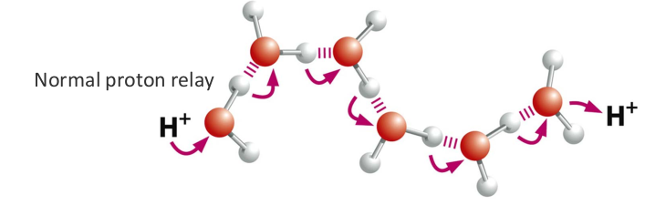
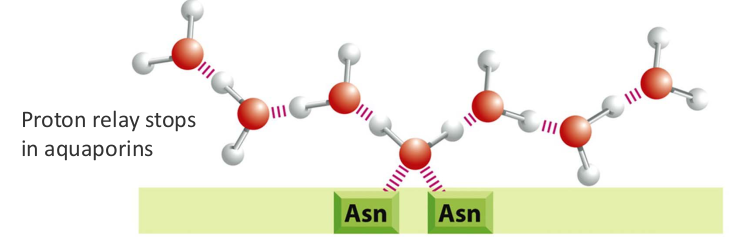
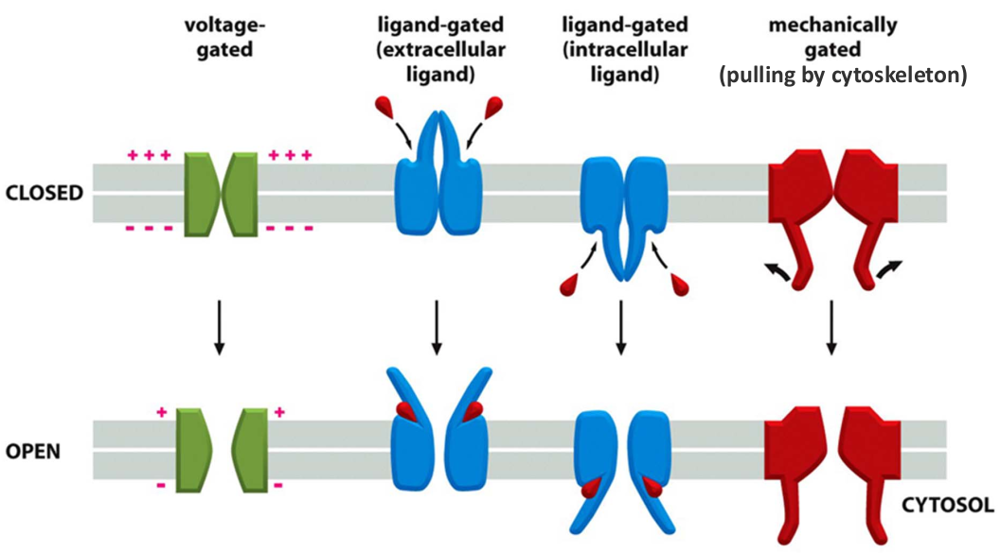

# 5. Transport of ions and small molecules across membranes
> 20181008 H.F.

## 5.1 Principles of Membrane transport

Ions are distubuted diferently indsid and outside a cell.

In simple diffusion, some molecules can simple cross the lipid bilayer by
diffusion. diffusion rate depends on concentration, hydrophobicity & size,
which is influenced by the electrical gradient.

> electrochemical gradient is important factor(how to model)

O2, CO2, N2, steroid, hormones are hydrophobic and small uncharge polar
molecules which are free pass the hydrophobic liqid bilayer. But lots of
materials can not pass throgh membrane, **channels** & **transporters** are two
major classes of membrane protein to help these molecules accross membranes.
Channels don't change conformation during transport, but transporter do it.
They play different role.

**Passive transport** down the electrochemical gradient. **Active transport**
against the electrochemical gradient. Here are 3 kind of active transport: 
ATP driven pump, coupled transporter, light-driven transport.

| Channels      | Transporters      | Energy-driven pumps 
|---------------|-------------------|---------------------
| always passive transport | facilite molecule against/down gradient | against
| low binding affinity     | hight binding affinity      | requires energy
| $10^7$-$10^8$ ions/second| $10^2$ - $10^4$ ions/second | 1-1000 inos/second

## 5.2 Channels: A super efficent protein
Always do passive transport. nogated (open most of time)
huage capacity 10^7-10^8 ion per second

To maintain appropriate solute concentration to avoid osmotic swelling, cell
use different ways. Animal cell export of ions, plant cell stabilized by rigd
cell wall and protozoan export of water by discharging contractile vacuole.

Here are two typical channels: **water channel**(aquanporins) and 
**ion channels**. Water channel buid up a hyrophilic pore to transfer water, but
two Asparageines on water channel techer two water and prohibit H+ to pass.

Ion Channel: 1). Highly selective, >100 types 2). High efficency, 100 million
ions/second 3). Tight close and open(fluctuation!) Here 4 ways to open the
"gate": voltage-gated, ligand-gated(extracelluar ligand), 
ligand-gated(intracelluar ligand), mechnically gated (hair cell of ear)

How the K+ channel work: vestibule and selectivity filter. What about the
function of water?

## 5.3 Transporters: great helper, but nothing is for free...
Active transport is mediated by transporters coupled to an energy source. There
are three main types: _uniport, antiport, symport_. Transport undergo
comformational changes, bind molecules more tightly, 100-10000 molecules/second.

_GLUT1_(Glucose transporter 1) is an uniporter, which transports glucose from
the extracellular space into cytosol(bood-brain barrier). Glu --> Glu-6-P.

_Bacteriorhodopsin_ is light-driven proton pump, which pump H+ from cytosol to
exitracelluar space.

For symporteer, energy is stored in electochemical gradients, which couple the
Na+ or H+ gradient with hte transport of other molecules.
_SGLT1_(The sodium-dependent glucose transporter 1) transfer gluocose in help
with Na+ gradient. _Lactost permease_ is symport of lactose and H+ in E.Coli.

**Antiporter** is used regulate pH for cells. Na+-H+ exchanger(in:Na+, ef:H+),
Na+-driven Cl--HCO3- exchanger(in:Na+, HCO3-, ef:Cl-,H+), Na-independent
Cl-HCO3- exchanger(in HCl ,ex: NaHCO3)

## 5.4 ATP Pumps: molecular machines
All pumps are active transporters. Here are 3 types pumps as following. One or
more ATP binding sites on the cytosolic portion of these transportes. Most
ATP pump transport ions, but most ABC transporters transport small molecules.

1. P-type(pho):
	+ Ca2+ pump(endoplasmic reticulum in eukaryotic cell)
	+ Ca2+ ATPase
	+ Na+ /K+ pump
	+ H+ /K+ pump
2. F-type: ATP-synthase/ATPase
3. V-type: VHA ATPase
4. ABC-type : Multidrug resistance protein(MDR)
	+ CFTR

P-type pump is different with F-type pump.

**P-type pump**: they phosphorylate themsleves during pumping cycle. Such as,
the Ca2+ pump or Ca2+ ATPase. Phosphorylation of the Ca2+ pump induces the
conformational change that drive pumping. 

The Na+-K+ ATPse is a major regulator of osmolarity and it is an electrogenic
pump: export 3 Na+ vs. 2 K+. First step: in the cyotosolic surface the
non-phosphorylated tarnsporter has high affinity for Na+ inos but only low
affinity for K+ ions. Second step: 

**ATP synthases** 

**V-ATPase**(vacuolar-type transporter): only 

**ABC transporter**: Multidrug resistance(MDR) protein is the first eukaryotic
ABC transporter indentifide. Cystic fiborosis transmembrane conductance
regulator(**CFTR**), which regulates open and close of Cl- channel and . 

## 5.5 Neuron electric potential
Membrane potential 
-20mV to -120mV

K+ channel 

Action potential: a depolorization signal on the plasma membrane --> Voltage-gated
Na+ channels open, cause influx of Na+ --> Opening of more Na+ channel, positive
feedback --> 

Slower kinectis than Na+ channel.

excitatroy neurotransmitters open cation channels, causing influx of Na+ and
firing of action petential. Inhibitory neurotransmitters open Cl- or K+ channels,
casusing delays of action potential.

| Snake toxins | bind to acetylcholine receptors and inhibit them
| Curare       | bind to acetylcholine recetpors
| Barbiturates transquilizers | bind to GABA receptors
| Prozac      | inihibits uptake of serotin
