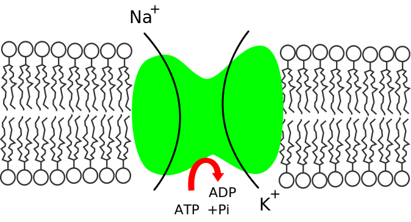

# 5. Transport of ions and small molecules across membranes
> 20180926 H.F.

## Principles of Membrane transport

Ions are distubuted diferently indsid and outside a cell

### Simple diffusion
1. O2, CO2, N2, steroid, hormones; glucose, sucrose,
Slove
	diethylurea: k=0.1	urea: k=0.001

Rate dependent on concentration, electrochemical gradient

### Two transport protein 
Tansporter and channel

electrochemical gradient is important factor(how to model)

Passive : down the electrochemical gradietn
Active transprot against the electrochemical gradient. Here are 3 kind of active
transport: ATP driven pump, coupled transporter, light-driven transport.
Passive

|
| down its gradietn 10^7-10^8| bind molucules tightly, undergo confomationlchanges, |
|

### Channel: A super efficent protein.
1. onogated (open most of time)
2. huage capacity 10^7-10^8 ion per second

ion-channel

Mean: maintain appropriate solute concentration to avoid osmotic swelling

��ˮ�����ϵ�ճҺ��ֹϸ���Ų�

## Aquaporins increase the water

Water can transfer, but ASN on water channel stop the transfer of H+.

## Ion Channel
1. Highly selective, >100 types

2u. High wefficency
+ 3. Tight close and open
voltage-gated, ligand-gated(extracelluar lighd), ligand-gated(intracelluar ligand), mechnically gated
(hair cell of ear)

��Ӭ�ݵ�δ��֮��
How the K+ channel work
�ѵ�������Ҫ��һ������ѡ����

Active transport is mediated by transporters coupled to an energy Source. There
are three main types: uniport, antiport, symport. Transport undergo
comformational changes, binding molecules more tighly, low speed.

## 5.2 Channels
Here gap junctions, ion channels.

The water chanel. Water can transfer, but ASN on water channel stop the transfer
of H+.

Ion channels: high efficiency... voltage gated, mechanically gated. Such as the
mechanical gated channel. 

## 5.3 Transportes
Change the conformation. Here are three main types: Uniporter, Symporter,
Antiporter.

Uniporter-GLUT1(The)

Bacteriorhodopsin: 

**Symporteer** couple ithe Na and H+ gradient in trasport. Glucose can help to
transfer in help with Na+. 

**Lactost permease**: symport of lactose and H+ in E.Coli

**Antiporter** - a way for cells regulate PH.

+ export H+: Na+/H+ exchange
+ import/export HCO3-: Na+-driven Cl-/HCO3- exchange; Na+-indenpent Cl-HCO3-
exchange acidify.

## 5.4 ATP Pumps
All pumps are active.

1. P-type(pho):
	+ Ca2+ pump(endoplasmic reticulum in eukaryotic cell)
	+ Ca2+ ATPase
	+ Na+ /K+ pumpb
	+ H+ /K+ pump
2. F-type:
3. V-type:
4. ABC-type():
	+ CFTR
P-type pump is different with F-type pump.

**P-type pump**: they phosphorylate themsleves during pumping cycle. Such as,
the Ca2+ pump or Ca2+ ATPase. Phosphorylation of the Ca2+ pump induces the
conformational change that drive pumping. 

The Na+-K+ ATPse is a major regulator of osmolarity and it is an electrogenic
pump: export 3 Na+ vs. 2 K+. First step: in the cyotosolic surface the
non-phosphorylated tarnsporter has high affinity for Na+ inos but only low
affinity for K+ ions. Second step: 

**ATP synthases** 

**V-ATPase**(vacuolar-type transporter): only 

**ABC transporter**: Multidrug resistance(MDR) protein is the first eukaryotic
ABC transporter indentifide. Cystic fiborosis transmembrane conductance
regulator(**CFTR**), which regulates open and close of Cl- channel and . 

# 5.5 Neuron electric potential
Membrane potential 
-20mV to -120mV

K+ channel 

Action potential: a depolorization signal on the plasma membrane --> Voltage-gated
Na+ channels open, cause influx of Na+ --> Opening of more Na+ channel, positive
feedback --> 

Slower kinectis than Na+ channel.

