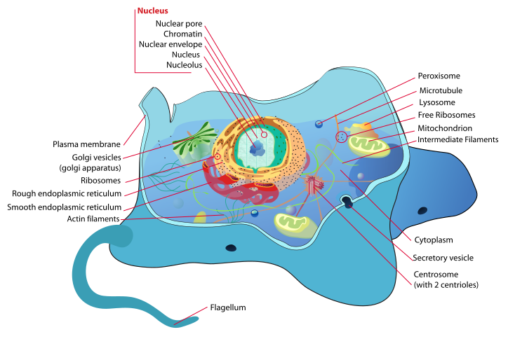
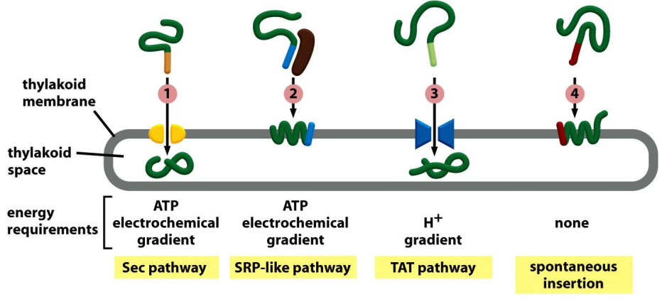

# 6. Transport of macromolecules I
> 20181008 H.F.

## 6.1 Cell compartments

The major intracellular compartments of an animal cell

The import of cell member system in cell
Why the explentd inner member? Because small surface/volume ratio

How cell shape is determined?

Sets of protein decide the function of
All the protein is made in cytosol

Infomate bettile, most protein without sorting stay in cytosol, protein with
sorting signal will be transproted by three way:

+ Gated transport:  proteins move betwween cytosol ans nucleus through nuclear
pore complex(NPC)
+ Transmembrane transport: 
+ Vesicular transport

Three kind of signal seq

+ N-terminal signal seq: 15-60 aa long,  import into plastid (one 亲水，疏水)
+ Internal Stretches of amnino acids
+ Signal path

## 6.2 Transprot between the nucleus and the cytosol
Bi-direction, both import and export. 
Any cargo with a nuclear lcalization singal(NLS) exposed will
destined for quick and efficient transport through the pore. Gnenerally
containing a conserved sequence with basci residues such as PKKKRKV.

摆渡人
Ran-GAP, Ran-GEF

example: T cell

> why exist nuclear fibrilin NPC

## 6.2 Transport in Mitochondrionand Choroplast
Fully synthesized in the cytosol before their import.

Why the complex are encode by both mtDNA and nucleus encode

Protein translocators --  TIM , TOM
TIM23, TIM

ATP and mebrane poteintal drive  import into the matrix space

chaperones(分子伴侣)，
gap

into outer

into inner

Different ways to import proteins into inner memebrane(IM) and in the
intermembrane space(IMS)

## 6.3 Transport in Chloroplast
Two signal peptides directs proteins to the thylakoid, the first to reach the
stroma, the second to reach the thylakoids(thylakoid-specific)

Transloction into the thylakoid space or thylakoid membrane by different 4
routes.

## 6.4 Transport in peroxisome(过氧化物体）
All eukaryotic cells have peroxisomes. Acquire most protein from cytosol, some
from ER. Plants contain two types of peroxisomes:
 
- Leaf peroxysomes

Peroxisomes oxidize a variety of. Peroxisome is important to synthesis
plasmalogen.

We don't know how the peroxisomes arise: 

## 6.5 Transport in Endoplasmic Reticulum
highly dnaymics

Co-translational: Almost all protein in ER.

Rough and smooth microsomes

How is a protein trageted to ER and transported? A signal recogntion particle
(SRP) stops the tranlstion and guides the complex to the translocation here.

Three ways in which protein translcation can be driven through structure similar
translocators. Insertion of a single-pass transmembrane protein via N-terminal
start-transfer singal and an interval stop-transfer signal. Charge of aa that
flank the internal signal sequence determine the typeI//II configuration.

Multi-pass transmembrane proteins, ER tail-anchored protein is intergrated by
a special mechanism.

Soluble ER-resident. Protein folding and "quality control" in the ER. Most 
protens in Rough ER are clycosylatd by the addtion of a common N-linked
oligosaccharids. Oligosaccharides are used as tasgs to mark the state of
protein flolding; Improperly folding proteins are exported from the ER and
degraded in the cytosol. Misfloded proteins in the ER activeate an unfolded
protein response. Activation of transcription of genes involved an unfolded
protein response.

Some ER resident proteins
+ translocated polypeptide chains are folded and assemebled in the ER lumen.
+

Rough ER-glycosylation
Misfolded proteisn in the ER activate an unfolded protein response.

Activation of transcription of genes involvd in unfolded protein response.

## Phospholipid synthesis in ER
Nearly all major lipids are synthesized in ER, including Phospholipid,choleserol, ceramide.

### Synthesis of phosphatidylcholine
### Symmetry and asymmetry in ER and plasma membrane.
### ER production of ceramide
