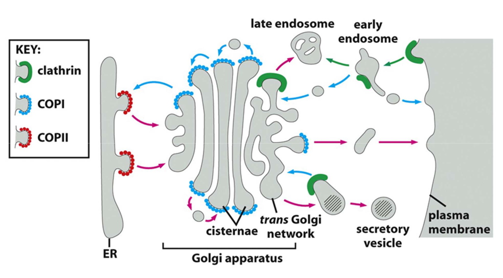

# 7. Transport of macromolecules II: Vesicular transport
> 20181019 H.F.
> Peter: try to find interest thing
> H.F.: This chapter must read book!!! So confused and unordered

## 7.1 Overview of vesicular traffic
All almost contains **exocytosis** and **endocytosis**. Membrane orientation
don't change during vesicular transport.

Molecules undergo exocytosis in vesicular traffic：
+ Plasma membrane proteins: Cell surface receptors, Transporters, Ion channels
+ Soluble protein: digestive enzymes, peptide hormones, collagen, ECM proteins,
etc
+ From endosome to lysosome: unneeded protein, hydrolases(proteases,
glycosidases, phosphatases,lipases), some amino acid for storage

Molecules undergo **endocytosis** 
+ Large nutrient macromolecules is too large to be transported by
transporters/channels: cholesterol-LDL, iron-transferrin, vitamins, etc.
+ Receptors, translocators, ATPase of the PM are endocytosed and degraded to
down-regulate their activities.
+ Some bacteria that are internalized into cells
+ Some viruses

Transport vesicles are characterized by a specific set of "coat" proteins,
which drive formation of the vesicles, including clathrin, COPI COPII. These
coat protein function on 1) _selection & concentration_ of specific proteins
for transport 2)_mold_ the vesicle.

**Clathrin** is made of 3 large and 3 small polypeptide chain, which assemble into
a "three-legged" triskelion. A clathrin cage with a single triskelion highlighted in blue. CryoEM map
EMD_5119 was rendered in UCSF Chimera and one clathrin triskelion was
highlighted.

Each cage has 12 pentagons. Mini-coat (left) has 4 hexagons and tetrahedral
symmetry as in a truncated triakis tetrahedron. Hexagonal barrel (middle) has
8 hexagons and D6 symmetry. Soccer ball (right) has 20 hexagons and icosohedral
symmetry, it is a truncated icosohedron.

Clathrin-coated vesicles (CCV) cargo is recognized by tetrameric _adaptor
protein_(**AP**) complexes. To form CCV cargo, 1) Membrane binding to the open
the binding pocket for the cargo interaction.??? 2) Cargo binding. 3) Clathrin
recruitment. Multiple factors confer location and time-specificity: 
+ Different locations for PIPs to regulate targeted vesicular transport.
+ Different head groups allow for specific interaction with proteins
+ Activation and recruitment of coat-recruiting GTPases: ARF, Sar 

Membrane-bending proteins help deform the membrane during vesicle formation,
whose **BAR**(Bin/Amphiphysin/Rvs) **domains** induce curvature of membranes
by charge-charge interaction. In other side, Dynamin function on pinching off
of the vesicles, whose PI(4,5)-P2 domain and GTPase domain regulates its
function.

Rab proteins direct the vesicle to the correct target sites. SNARE proteins 
mediate the fusion of the lipid bilayer. Rad-GDP is inactive and cytosolic,
usually bound to Rab-GDP-dissociation inhibitor(GDI). Rab proteins guide
transport vesicle to their target membrane. Activated by membrane bound Rab-GEF
(Guanine exchange factor) and become Rab-GTP(active form).

cascade(级联)

To ensure vesciles are targetd to specific site for fusion. Rab protein can
direct the vesicle to the correct target sites.SNAR.

Activation --> Recruitment

SNARES mediate membrane fusion.

Dissociation of SNARE pairs after membrane fusion requires ATP hydrolysis by 
the AAA-ATPase NSF(N-enthylmaleimide-sensitive-factor)

## 7.2. Techniques to study vesicular traffic
Radiolabelled amino acids(pulse-chase), GFP-fusion proteins, Cell-free systems,
and genetic study with yeast temperature-sensitive mutants.

## 7.3 Transport from ER to Golgi apparatus
Glycosylation: nitrogen of an amino group, oxygen of. folding, resistrant, cell
cell recognition, 

## COP II-coated transp ort vesicle
T-cell receptor(TCR)

function for glycosylation

Compart

## 7.4 Transport from trans-Golgi to lysosome
Activation of many enzymes needs proteolytic cleavage and acidic environment. 
Lysosomes can found in all eukarotic cells, which can breakdown intra-and
extracelluar debris, destruction of phagocytosed microorgamism, and production
of nutrients for the cell.

Bid-
The recognition of a lysomal hydrolase: synthesis of the lysomal sorting signal.
Lysomal sorting signals on soluble lysosomal proteins emerge in the TGN.

So, how are hydrolases selected for transported to lysosomes?
Ther
multiple function, different maturation stages

break down in =side fa=nd

Three pathways for degradation in lysosomea

Lysosomla sorting receptor: mannose 6-phosphate receptor(MPR)

## 7.5 Endocytosis
_Phagocytosis_ and _pinocytosis_ is two major types of **endocytosis**.
Phagocytosis is for large particle, a selective process, phagosomes are > 250nm
in diameter, is import to scavenge old and dead cells, and is important to eat
outside pathogens. Pinocytosis is for fluid and solute, a continuous process,
pinocytic vesicles ~100nm in diameter.

> A **macrophage** is "eating" two red blood cells, a macrophage can eat 10^11
old RBCs per day.

Antibody coated pathogens, complements in pathogens,

Pinocytosis occurs continuously and fast(several percent /min of
plasma membrane). Well balance between endocytosis and exocytosis should be
occurs in serval ways: clathrin-coated pits, caveolae mediated(believed to start
from lipid rafts).

Endocytosis mediated by Clathrin-coated pits, called receptor mediated
endocytosis. About 25 different receptors mediated this type of endocytosis.
Many different receptors cluster in the same pit. The same receptors can
cluster in different pits.

> Example: Taking up of cholesterol by LDL receptor on cells.

The endocytosed materials can be _recycling, transcytosis and degradation_.

Transcytosis transport material from one side of cytosis to other side.

> Glucose transporter can be relocalization

Multivesicular bodies derive from early endosome, move along Microtubles, then
turn to be late endosomes, which are targeted to degradation some.

Constitutive and regluated secretory pathways. 

> Exocytosis of secretory vesicles is import to cure HIV.

Caveolae mediated pinocytosis. Cell activiely regulate receptor mediated
endocytosis. clathrin(内涵蛋白)
Example: Taking up of E

Fate of endocytosed materials.

### 5.2 Transcytosis -- in poliarized epithelial cells
免疫球蛋白进入婴儿体内。

## 7.6 Exocytosis: From TGN to PM
Here are two different secretory pathways: constitutive secretion and regulated
secretion. All cell has constitutive pathway, which transport membrane proteins,
lipid molecules, ECM proteins. But regulated pathway only exist in special
secretory cell, which transport hormones, histamine, etc, neurotransmitters,
digestive enzymes

How voltage-gated Ca2+ channel influx Ca2+.

What happpens to the membrane lipid and proteins after exocytosis?

TYea

## References
- https://en.wikipedia.org/wiki/Clathrin
