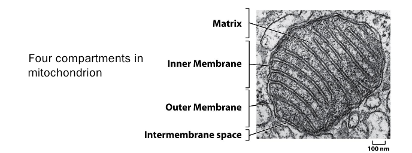
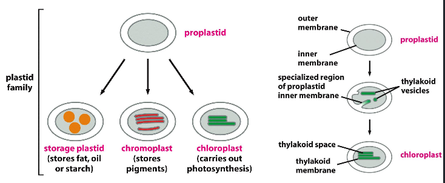
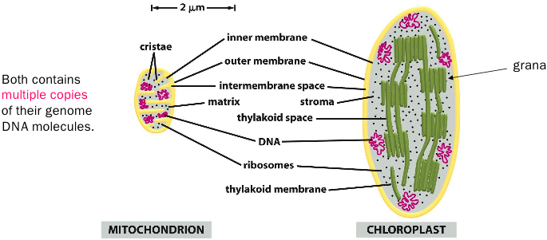
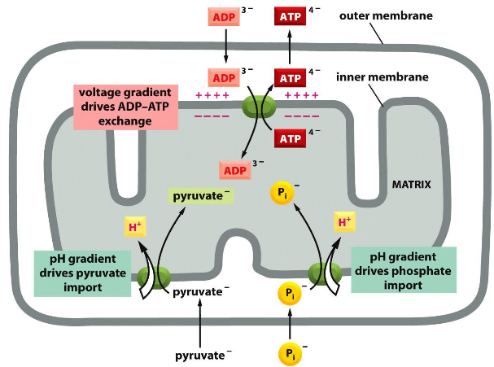
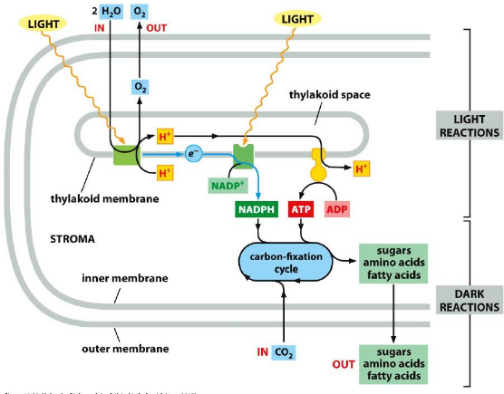

# Mitochondrion and chloroplast

## I. Mitochodrion structure and its compartment
+ Outer membrane: Porins and is highly permeable to molecules 5kd
+ Inner membrane: ( 20% is Cardiolipin 心磷脂) Highly selective in permeability for molecues, and contain the
protein for electron transport proteins and ATP synthase, transporters.
+ Intermembrane space: contain enzymes to use ATP to phosphorylate other
nucleotides.
+ Matrix: contain lots of enzymes for citric acid cycle, pyruvate oxidation,
fatty acid oxidatino, mitochondria DNA, tRNA, ribosomes.

We can separate compartment using low osmotic solution, centrifugation, high
osmotic solution, density-gradient centrifugation to separate intermembrane space,
outermembrane, matrix and innermembrane.

Mitochodrion often associate with microtubes in cells, form moving filaments or
chains. Mitochodrions are mobile but remain fixed in energy requiring sites.
Mitochodrion are dynamic and fuse and separate constantly.

## II. Plastid and chloroplast structure/ function

All plastid is double membrane structure, share the same genome in one plant
species. Plastid is dependent on the different environment in different cells.
They are sites for photosynthesis, storage of materials(fat, oil,
starch), storage pigment.

Stroma contains many metabolic enzymes, chloroplast ribosomes, RNAs, chloroplast
DNA. The thylakoid membrane are sites of electron-transport chains, photosynthesis
light-capturing systems, ATP synthase.

The number of both mitochondria and chloroplast vary depending on physiological
conditions and needs of the cells.

Mitochodrion genes are inherited by a non-mendelian mechaism.

## III. Genetic sysytemcs in mitochondria and chlorplasts

**Gene transfer occurs after symbiosis events**, because:
+ 1.Most of mitochondria and chloroplast protein are encoded by nuclear genes.
+ 2.SOD in mitochondra more resembles that of bacteria than cytosolic SOD.
+ 3.Sequential reduction in mitochondria encoding genes during evolution.

**Transcription in mitochondria** occurs from one promoter but synthesis on
**both direction**. mRNA has **no 5'-cap** but has **poly A tail**. Some plant
and fungi mitochondria RNA has **intron**.

It is very interesting that some mitochondria genetic code are different from
universal genetic code(*Maby because mitochondria has own ribosomes*). Genes in
choloroplast genomes, all are highly similar.

Mitochondrial genes ar inherited by a non-mendelian mechanism.

Mutation in one of the mitochondria tRNA gene causes **Myoclonic epilepsy and
ragged fred**(MERRF). Deletion of majority of mitochondria or chloroplast DNA
cause **petite mutantion**.

For mitochondria, most lipid import from ER. For chloplast, most synthesized on
its own.

## IV Energy Conversion  in either mitochondria or c  holorplast
###Mitochodrion: Systems to provide energy for lives
Energy of electron transport is used to pump protons across membrane, then
protons gradient is hardnessed by ATP synthase to make ATP. **Electron** is
generated from electron donator, which contain high-energy electrons. Then,    
electrons are transfered by the electron transfer chain(**ETC**) in the inner
membrane of mitochondria. **ADP and Pi** are transported in by electrochemical
potential and proton gradient.

*Why voltage gradient can drive ADP-ATP exchange*

### Chloroplast capture energy from sunlight and usd to fixed carbons

Thylakoid membrane contains two different photosystems. ATP and NADPH are used
to convert CO2 into sugar. PS II use s mangnese cluster to withdraw electrons
from water.
