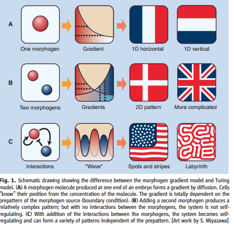

# Homework 5

## 1
A: Ture.

B: Flase. Ig bind to integrin, but cadhrins can bind to intermediate fiaments.
Acin and intermediate are make up of cytoskeletion, which is reponsible for cell
mechanism. It is helpful to hold cells together.

## 2
A: Because they express same kind of cadherin which can hold cell together, they
 would not segreate into two separate balls. Then high cadherin cell have more
 probility to jucntion with high cadehrin cell, which mean high cadeherin cell
 flavor to increase contact surface to form stronger junction. In other words,
 low cadherin cells are weak to compete high cadehrin cells, which means low
 cadherin cells has low contact surface in outside.
B: No sure. It main dependent on the ratio of the junction of intensity of 3
   cadherins. Maybe form the turing pattern.

(Kondo, S., & Miura, T. (2010). Reaction-Diffusion Model as a Framework for
Understanding Biological Pattern Formation. Science, 329(5999), 1616–1620.
https://doi.org/10.1126/science.1179047)
set

## 3

## 7
A-proto-oncogene;
B-transformation;
C-;
D-
E-;
F-tumor suppressor gene;
## 8
